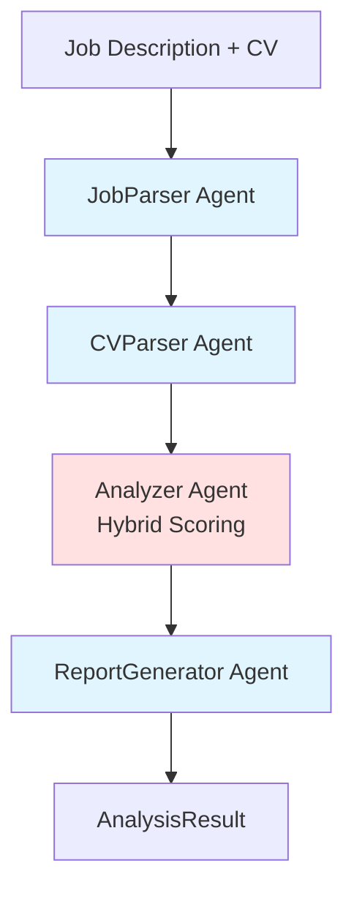

# Microsoft Agent Framework Implementation - Complete

**Date**: 2025-12-31  
**Status**: ✅ Implemented  
**Framework**: Microsoft Agent Framework (agent-framework-core, agent-framework-azure-ai)

## Overview

All AutoGen code has been removed and replaced with **Microsoft Agent Framework** as specified in ADR-001 and ADR-002.

## Implementation Details

### 1. Core Client Setup

**File**: [`app/utils/azure_openai.py`](app/utils/azure_openai.py)

```python
from azure.identity import DefaultAzureCredential
from agent_framework.azure import AzureOpenAIChatClient

# Create client with Entra ID authentication
credential = DefaultAzureCredential()
client = AzureOpenAIChatClient(
    credential=credential,
    endpoint=os.getenv("AZURE_OPENAI_ENDPOINT"),
    deployment_name=os.getenv("AZURE_OPENAI_DEPLOYMENT"),
    api_version="2024-08-01-preview",
)
```

**Key Changes**:
- ❌ Removed: `autogen_ext.models.openai.AzureOpenAIChatCompletionClient`
- ✅ Added: `agent_framework.azure.AzureOpenAIChatClient`
- ✅ Uses `DefaultAzureCredential` for Entra ID auth (ADR-002)

### 2. Agent Creation

**Files**: 
- [`app/agents/job_parser.py`](app/agents/job_parser.py)
- [`app/agents/cv_parser.py`](app/agents/cv_parser.py)
- [`app/agents/analyzer.py`](app/agents/analyzer.py)
- [`app/agents/report_generator.py`](app/agents/report_generator.py)

```python
# OLD (AutoGen) - REMOVED
from autogen_agentchat.agents import AssistantAgent
self.agent = AssistantAgent(
    name="JobParser",
    model_client=openai_client,
    system_message=self.SYSTEM_MESSAGE,
)

# NEW (Microsoft Agent Framework)
from agent_framework.azure import AzureOpenAIChatClient
self.agent = openai_client.create_agent(
    name="JobParser",
    instructions=self.SYSTEM_MESSAGE,
)
```

**Key Changes**:
- ❌ Removed: `autogen_agentchat.agents.AssistantAgent`
- ✅ Added: `AzureOpenAIChatClient.create_agent()` method
- ✅ Changed: `system_message` → `instructions`

### 3. Agent Execution

**All agent files updated**:

```python
# OLD (AutoGen) - REMOVED
result = await self.agent.run(task=prompt)
response_text = result.messages[-1].content

# NEW (Microsoft Agent Framework)
response = await self.agent.run(prompt)
response_text = response.content if hasattr(response, 'content') else str(response)
```

**Key Changes**:
- ✅ Direct string prompt instead of `task=` parameter
- ✅ Response object has `.content` attribute directly
- ✅ No more `.messages` array navigation

### 4. Sequential Orchestration

**File**: [`app/agents/orchestrator.py`](app/agents/orchestrator.py)

```python
class CVCheckerOrchestrator:
    def __init__(self, openai_client: AzureOpenAIChatClient):
        self.job_parser = JobParserAgent(openai_client)
        self.cv_parser = CVParserAgent(openai_client)
        self.analyzer = HybridScoringAgent(openai_client)
        self.report_generator = ReportGeneratorAgent(openai_client)
    
    async def execute(self, cv_markdown: str, job_description: str) -> AnalysisResult:
        # Step 1: Parse job
        job_requirements = await self.job_parser.parse(job_description)
        
        # Step 2: Parse CV
        candidate_profile = await self.cv_parser.parse(cv_markdown)
        
        # Step 3: Analyze (hybrid scoring)
        hybrid_score = await self.analyzer.analyze(
            job_description, cv_markdown,
            job_requirements, candidate_profile
        )
        
        # Step 4: Generate report
        report_data = await self.report_generator.generate(
            hybrid_score.to_dict(),
            job_requirements,
            candidate_profile
        )
        
        return self._build_analysis_result(...)
```

**Implements ADR-001**:
- ✅ Sequential pattern (linear workflow)
- ✅ Clear agent execution order
- ✅ Explicit data passing between steps
- ✅ No group chat or handoff complexity

### 5. Dependencies Updated

**File**: [`requirements.txt`](requirements.txt)

```diff
- autogen-agentchat==0.4.0
- autogen-ext[openai]==0.4.0
+ agent-framework-core
+ agent-framework-azure-ai
```

**File**: [`pyproject.toml`](pyproject.toml) ✅ Already correct

```toml
dependencies = [
    "agent-framework-core",
    "agent-framework-azure-ai",
    "azure-identity>=1.19.0",
    # ... other deps
]
```

## Agent Workflow



## Compliance with ADRs

### ADR-001: Sequential Orchestration ✅

- ✅ Uses Microsoft Agent Framework
- ✅ Sequential pattern (JobParser → CVParser → Analyzer → ReportGenerator)
- ✅ Predictable execution flow
- ✅ Clear input/output contracts
- ✅ No group chat or handoff patterns

### ADR-002: Azure OpenAI + Entra ID ✅

- ✅ Uses `AzureOpenAIChatClient` from `agent_framework.azure`
- ✅ `DefaultAzureCredential` for Entra ID authentication
- ✅ No API keys in code
- ✅ Environment-based configuration
- ✅ gpt-4-1 deployment model

### ADR-003: Hybrid Scoring ✅

- ✅ Deterministic scoring (60%): Skills + Experience
- ✅ LLM semantic scoring (40%): Transferable skills + Soft skills
- ✅ Maintained through framework migration

## Testing

Run verification:

```bash
# Install dependencies
uv sync

# Run verification script
uv run python verify_phase3.py

# Start server
uv run uvicorn app.main:app --reload

# Test endpoint
curl -X POST http://localhost:8000/api/v1/analyze \
  -H "Content-Type: application/json" \
  -d '{
    "cv_markdown": "# John Doe\n\n## Skills\n- Python, FastAPI\n\n## Experience\nSenior Developer (2020-2024)",
    "job_description": "Senior Python Developer needed. FastAPI experience required."
  }'
```

## Environment Variables

Required in `.env`:

```bash
AZURE_OPENAI_ENDPOINT=https://your-resource.openai.azure.com/
AZURE_OPENAI_DEPLOYMENT=gpt-4-1
AZURE_OPENAI_API_VERSION=2024-08-01-preview

# For local dev (or use az login):
AZURE_TENANT_ID=your-tenant-id
AZURE_CLIENT_ID=your-client-id  
AZURE_CLIENT_SECRET=your-client-secret
```

## Migration Summary

| Component | Before (AutoGen) | After (Microsoft Agent Framework) | Status |
|-----------|-----------------|----------------------------------|--------|
| Client | `AzureOpenAIChatCompletionClient` | `AzureOpenAIChatClient` | ✅ |
| Agent Creation | `AssistantAgent(model_client=...)` | `client.create_agent(name, instructions)` | ✅ |
| Agent Execution | `agent.run(task=prompt)` | `agent.run(prompt)` | ✅ |
| Response | `result.messages[-1].content` | `response.content` | ✅ |
| Auth | `get_bearer_token_provider` | `DefaultAzureCredential` (direct) | ✅ |
| Dependencies | `autogen-agentchat`, `autogen-ext` | `agent-framework-core`, `agent-framework-azure-ai` | ✅ |

## Files Modified

1. ✅ `app/utils/azure_openai.py` - Client setup
2. ✅ `app/agents/orchestrator.py` - Type hints
3. ✅ `app/agents/job_parser.py` - Agent creation & execution
4. ✅ `app/agents/cv_parser.py` - Agent creation & execution
5. ✅ `app/agents/analyzer.py` - Agent creation & execution (LLMSemanticValidator)
6. ✅ `app/agents/report_generator.py` - Agent creation & execution
7. ✅ `app/services/cv_checker.py` - Type hints
8. ✅ `requirements.txt` - Dependencies

## Next Steps

1. **Test**: Run full integration tests
2. **Deploy**: Update Azure deployment with new dependencies
3. **Monitor**: Verify agent execution logs
4. **Document**: Update API docs with framework info

## References

- [Microsoft Agent Framework Docs](https://microsoft.github.io/agent-framework/)
- [ADR-001](../specs/adr/ADR-001-microsoft-agent-framework-sequential-orchestration.md)
- [ADR-002](../specs/adr/ADR-002-azure-openai-integration-entra-id.md)
