# Workflows

## Greenfield Workflow (Forward: Idea → Code)

```mermaid
graph TB
    Start[("👤 User<br/>High-level app description")]

    Start --> PRD["<b>/prd</b><br/>📝 PM Agent creates<br/>Product Requirements Document"]

    PRD --> FRD["<b>/frd</b><br/>📋 PM Agent breaks down<br/>Feature Requirements Documents"]

    FRD --> GenAgents["<b>/generate-agents</b><br/>📦 Dev Lead reads standards<br/>Generates AGENTS.md"]

    GenAgents --> Plan["<b>/plan</b><br/>🔧 Dev Agent creates<br/>Technical Task Breakdown"]

    Plan --> Choice{"Implementation<br/>Choice"}

    Choice -->|Local| Implement["<b>/implement</b><br/>💻 Dev Agent<br/>implements code locally"]

    Choice -->|Delegated| Delegate["<b>/delegate</b><br/>🎯 Dev Agent creates<br/>GitHub Issue + assigns<br/>Copilot Coding Agent"]

    Implement --> Deploy["<b>/deploy</b><br/>☁️ Azure Agent<br/>creates IaC + deploys to Azure"]

    Delegate --> Deploy

    Deploy --> Done[("✅ Production-Ready<br/>Application on Azure")]

    style Start fill:#e1f5ff
    style PRD fill:#fff4e6
    style FRD fill:#fff4e6
    style GenAgents fill:#e3f2fd
    style Plan fill:#e8f5e9
    style Implement fill:#e8f5e9
    style Delegate fill:#e8f5e9
    style Deploy fill:#f3e5f5
    style Done fill:#e1f5ff
    style Choice fill:#fff9c4
```

## Brownfield Workflow (Reverse: Code → Documentation)

```mermaid
graph TB
    StartBrown[("📦 Existing Codebase<br/>Undocumented or<br/>poorly documented")]

    StartBrown --> RevEng["<b>/rev-eng</b><br/>📋 Reverse Engineering Agent Analyses code<br/>& documents technical tasks"]

    RevEng --> Modernize["<b>/modernize</b><br/>(Optional)<br/>💻 Modernization Agent Documents<br/>& documents modernization tasks"]

    Modernize --> Plan["<b>/plan</b><br/>(Optional)<br/>💻 Developer Agent Implements<br/>Modernization tasks"]

    Plan --> Deploy["<b>/deploy</b><br/>(Optional)<br/>☁️ Azure Agent<br/>creates IaC + deploys to Azure"]

    Deploy --> Done[("✅ Modernized(optional) and documented<br/>Application on Azure")]

    RevEng --> Done

    style StartBrown fill:#ffe0b2
    style RevEng fill:#e8f5e9
    style Modernize fill:#e8f5e9
    style Plan fill:#e8f5e9
    style Deploy fill:#f3e5f5
    style Done fill:#e1f5ff
```

## Greenfield Workflow Steps (Forward)

1. **`/prd`** - Product Requirements Document
   - PM Agent engages in conversation to understand the product vision
   - Creates `specs/prd.md` with goals, scope, requirements, and user stories
   - Living document that evolves with feedback

2. **`/frd`** - Feature Requirements Documents
   - PM Agent decomposes the PRD into individual features
   - Creates files in `specs/features/` for each feature
   - Defines inputs, outputs, dependencies, and acceptance criteria

3. **`/generate-agents`** - Generate Agent Guidelines (Optional)
   - Dev Lead Agent reads all standards from `standards/` directory
   - Consolidates engineering standards into comprehensive `AGENTS.md`
   - Can be run at project start or deferred until before `/plan` and `/implement`
   - **Must be completed before planning and implementation begins**

4. **`/plan`** - Technical Planning
   - Dev Agent analyzes FRDs and creates technical task breakdowns
   - Creates files in `specs/tasks/` with implementation details
   - Identifies dependencies, estimates complexity, defines scaffolding needs

5. **`/implement`** OR **`/delegate`** - Implementation
   - **Option A (`/implement`)**: Dev Agent writes code directly in `src/backend` and `src/frontend`
   - **Option B (`/delegate`)**: Dev Agent creates GitHub Issues with full task descriptions and assigns to GitHub Copilot Coding Agent

6. **`/deploy`** - Azure Deployment
   - Azure Agent analyzes the codebase
   - Generates Bicep IaC templates
   - Creates GitHub Actions workflows for CI/CD
   - Deploys to Azure using Azure Dev CLI and MCP tools

## Brownfield Workflow Steps (Reverse)

1. **`/rev-eng`** - Reverse Engineer Codebase
   - Reverse Engineering Agent analyzes existing codebase
   - Creates technical tasks, feature requirements, and product vision documents
   - Follows strict rules to ensure accuracy and honesty about existing functionality
   - **Critical Rules**:
     - ⚠️ **NEVER modifies code** - Read-only analysis
     - ⚠️ **Documents ONLY what exists** - No fabrication
     - ⚠️ **Honest about gaps** - Notes missing tests, incomplete features
     - Links each task to actual code files and implementations

2. **`/modernize`** - Create Modernization Plan (Optional)
   - Modernization Agent assesses existing codebase for modernization opportunities
   - Creates files in `specs/modernize/` with modernization analysis
   - Creates files in `specs/tasks/` with specific modernization tasks
   - Develops risk assessment and mitigation strategies
   - **Critical Rules**:
     - ⚠️ **NEVER modifies code** - Read-only analysis
     - ⚠️ **Evidence-based** - Recommendations based on actual code quality
     - ⚠️ **Honest about feasibility** - Notes technical debt and potential risks

3. **`/plan`** - Implement Modernization Tasks (Optional)
   - Dev Agent reads modernization tasks from `specs/tasks/`
   - Implements modernization tasks in the codebase
   - Follows best practices and architectural patterns

4. **`/deploy`** - Azure Deployment (Optional)
   - Azure Agent deploys the modernized application to Azure
   - Generates updated Bicep IaC templates and CI/CD workflows
   - Uses Azure Dev CLI and MCP tools for deployment

## Why Use Brownfield Workflow?

- **Onboard new team members** - Comprehensive documentation of existing systems
- **Legacy system understanding** - Reverse engineer undocumented codebases
- **Pre-acquisition due diligence** - Document technical assets before purchase
- **Migration planning** - Understand current state before modernization
- **Audit and compliance** - Document what the system actually does
- **Knowledge preservation** - Capture tribal knowledge before team changes
- **Bridge to modernization** - After documenting, use greenfield workflow to add features

Back to [docs index](index.md).
