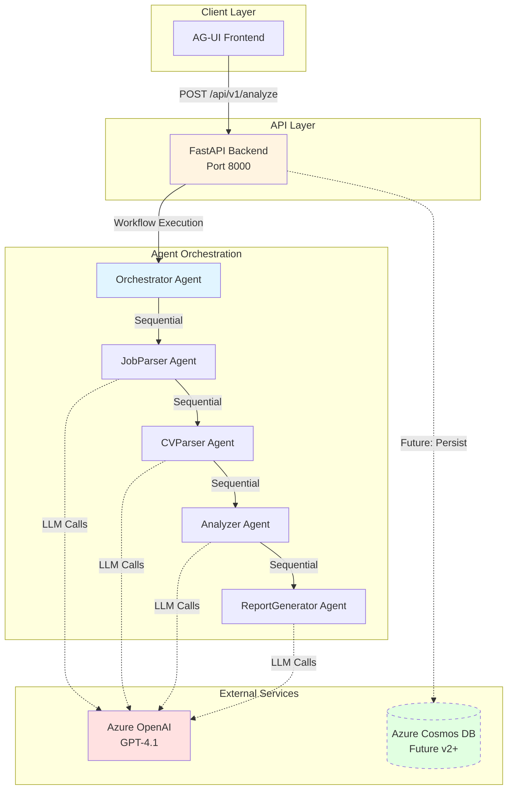
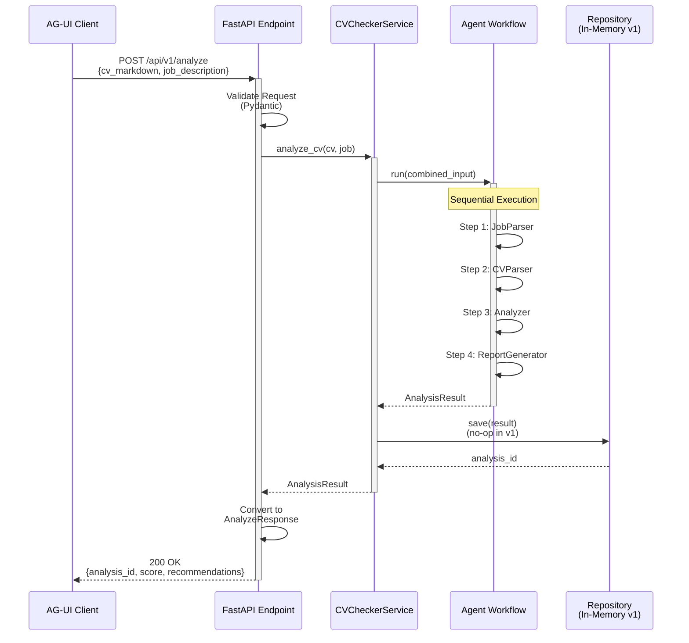
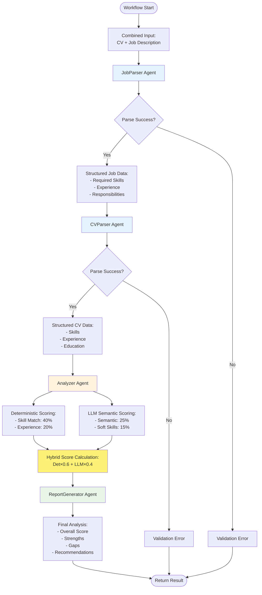
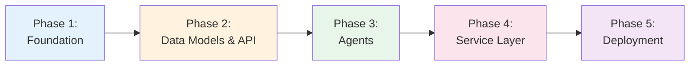

# CV Checker Backend Implementation Plan

**Version:** 1.0  
**Date:** December 31, 2025  
**Status:** Planning  
**Based on:** PRD v1.0, ADR-001 to ADR-005

---

## Overview

This document provides a complete implementation plan for the CV Checker backend system. The backend analyzes CVs against job descriptions using AI agents orchestrated through the Microsoft Agent Framework, powered by Azure OpenAI GPT-4.1.

**Key Technologies:**
- FastAPI (Python 3.11+)
- Microsoft Agent Framework (Sequential Orchestration)
- Azure OpenAI (GPT-4.1 with Entra ID)
- Azure Cosmos DB (future, v1 is stateless)
- Pydantic for validation

---

## System Architecture Diagrams

### L0: System Overview



### L1: API Request Flow



### L2: Agent Workflow Detail



---

## Implementation Phases

### Phase 1: Project Foundation (Week 1)

**Goal:** Set up development environment, project structure, and CI/CD pipeline.

#### Tasks

1.1. **Project Scaffolding**
   - [ ] Initialize Python 3.11+ project with Poetry/pip
   - [ ] Create directory structure:
     ```
     backend/
     ├── app/
     │   ├── __init__.py
     │   ├── main.py                 # FastAPI app
     │   ├── config.py               # Configuration
     │   ├── agents/
     │   │   ├── __init__.py
     │   │   ├── orchestrator.py
     │   │   ├── job_parser.py
     │   │   ├── cv_parser.py
     │   │   ├── analyzer.py
     │   │   └── report_generator.py
     │   ├── models/
     │   │   ├── __init__.py
     │   │   ├── requests.py         # API request models
     │   │   ├── responses.py        # API response models
     │   │   └── domain.py           # Domain models
     │   ├── services/
     │   │   ├── __init__.py
     │   │   └── cv_checker.py
     │   ├── repositories/
     │   │   ├── __init__.py
     │   │   └── analysis.py
     │   └── utils/
     │       ├── __init__.py
     │       └── azure_openai.py
     ├── tests/
     │   ├── unit/
     │   ├── integration/
     │   └── conftest.py
     ├── requirements.txt
     ├── pyproject.toml
     ├── .env.example
     └── README.md
     ```

1.2. **Dependency Installation**
   - [ ] Add core dependencies to requirements.txt:
     ```
     fastapi==0.109.0
     uvicorn[standard]==0.27.0
     pydantic==2.5.3
     pydantic-settings==2.1.0
     azure-identity==1.15.0
     azure-openai==1.0.0
     autogen-agentchat==0.4.0
     autogen-ext[openai]==0.4.0
     python-dotenv==1.0.0
     pytest==7.4.3
     pytest-asyncio==0.21.1
     httpx==0.25.2
     ```

1.3. **Azure OpenAI Setup**
   - [ ] Create Azure OpenAI resource in Azure Portal
   - [ ] Deploy GPT-4.1 model
   - [ ] Configure Entra ID authentication
   - [ ] Assign "Cognitive Services OpenAI User" role
   - [ ] Document endpoint and deployment name

1.4. **Configuration Management**
   - [ ] Create `.env.example`:
     ```
     AZURE_OPENAI_ENDPOINT=https://your-resource.openai.azure.com/
     AZURE_OPENAI_DEPLOYMENT=gpt-4-1
     AZURE_OPENAI_API_VERSION=2024-08-01-preview
     AZURE_TENANT_ID=your-tenant-id
     AZURE_CLIENT_ID=your-client-id
     AZURE_CLIENT_SECRET=your-client-secret
     ```
   - [ ] Implement `app/config.py` using Pydantic Settings

1.5. **CI/CD Pipeline**
   - [ ] Create `.github/workflows/backend-ci.yml`
   - [ ] Configure pytest with coverage
   - [ ] Set up linting (ruff/black)
   - [ ] Add type checking (mypy)

**Dependencies:** Azure subscription, Azure OpenAI access
**Deliverable:** Running FastAPI "Hello World" with Azure OpenAI connectivity test

---

### Phase 2: Core Data Models & API Foundation (Week 2)

**Goal:** Implement Pydantic models, FastAPI endpoints, and repository pattern.

#### Tasks

2.1. **Domain Models** (`app/models/domain.py`)
   - [ ] `SkillMatch` model
   - [ ] `AnalysisResult` model (Cosmos DB ready)
   - [ ] `JobDescription` model
   - [ ] `CVDocument` model
   - [ ] Add validation logic and examples

2.2. **API Request/Response Models** (`app/models/requests.py`, `responses.py`)
   - [ ] `AnalyzeRequest` with validation
   - [ ] `AnalyzeResponse` with examples
   - [ ] `ErrorResponse` standard format
   - [ ] `HealthCheckResponse`

2.3. **Repository Pattern** (`app/repositories/analysis.py`)
   - [ ] `AnalysisRepository` abstract base class
   - [ ] `InMemoryAnalysisRepository` implementation (v1)
   - [ ] `CosmosDBAnalysisRepository` skeleton (future)
   - [ ] Repository factory function

2.4. **FastAPI Application** (`app/main.py`)
   - [ ] Create FastAPI app with metadata
   - [ ] Configure CORS middleware
   - [ ] Implement lifespan events
   - [ ] Add global exception handlers
   - [ ] Configure OpenAPI docs at `/api/v1/docs`

2.5. **Health Check Endpoint**
   - [ ] Implement `GET /api/v1/health`
   - [ ] Test Azure OpenAI connectivity in health check
   - [ ] Return version and service info

**Dependencies:** Phase 1 completion
**Deliverable:** API with health endpoint, auto-generated docs, passing tests

---

### Phase 3: Agent Implementation (Weeks 3-4)

**Goal:** Implement all five AI agents using Microsoft Agent Framework.

#### Tasks

3.1. **Azure OpenAI Client Setup** (`app/utils/azure_openai.py`)
   - [ ] `AzureOpenAIConfig` class
   - [ ] `create_client()` with DefaultAzureCredential
   - [ ] Token provider setup
   - [ ] Connection pooling and retry logic
   - [ ] Unit tests with mocked credentials

3.2. **JobParser Agent** (`app/agents/job_parser.py`)
   - [ ] Create `AssistantAgent` with system prompt
   - [ ] Implement JSON extraction for:
     - Job title, company, location
     - Required skills (technical + soft)
     - Preferred skills
     - Experience requirements
     - Education requirements
   - [ ] Handle malformed job descriptions
   - [ ] Unit tests with sample job postings

3.3. **CVParser Agent** (`app/agents/cv_parser.py`)
   - [ ] Create `AssistantAgent` with Markdown parsing prompt
   - [ ] Extract sections:
     - Skills (technical/soft)
     - Work experience with dates
     - Education history
     - Projects and certifications
   - [ ] Normalize skill names
   - [ ] Calculate total years of experience
   - [ ] Unit tests with sample CVs

3.4. **Analyzer Agent** (`app/agents/analyzer.py`)
   - [ ] Implement `DeterministicScorer` class:
     - Skill match calculation (exact + normalized)
     - Experience alignment scoring
     - Education match scoring
   - [ ] Implement `LLMSemanticValidator` class:
     - Semantic skill matching
     - Transferable skills identification
     - Soft skills assessment
   - [ ] Implement `HybridScorer`:
     - Combine deterministic (60%) + LLM (40%)
     - Generate letter grade (A+ to F)
   - [ ] Comprehensive unit tests for scoring logic

3.5. **ReportGenerator Agent** (`app/agents/report_generator.py`)
   - [ ] Create `AssistantAgent` with report generation prompt
   - [ ] Generate sections:
     - Executive summary
     - Top 3 strengths
     - Top 3 improvement areas
     - Categorized recommendations (Add/Modify/Emphasize/Remove)
     - Priority tagging (High/Medium/Low)
   - [ ] Ensure actionable, specific recommendations
   - [ ] Unit tests validating report structure

3.6. **Orchestrator Agent** (`app/agents/orchestrator.py`)
   - [ ] Create `WorkflowBuilder` with sequential steps:
     1. parse_job → JobParser
     2. parse_cv → CVParser (depends on parse_job)
     3. analyze → Analyzer (depends on parse_cv)
     4. generate_report → ReportGenerator (depends on analyze)
   - [ ] Implement error handling and retry logic
   - [ ] Add logging at each step
   - [ ] Integration tests for full workflow

**Dependencies:** Phase 2 completion, Azure OpenAI access
**Deliverable:** Working agent workflow with end-to-end tests

---

### Phase 4: Service Layer & API Integration (Week 5)

**Goal:** Connect agents to API endpoints and implement business logic.

#### Tasks

4.1. **CV Checker Service** (`app/services/cv_checker.py`)
   - [ ] `CVCheckerService` class
   - [ ] `analyze_cv()` method:
     - Execute agent workflow
     - Save to repository (no-op in v1)
     - Return AnalysisResult
   - [ ] Error handling and logging
   - [ ] Performance tracking (timing)

4.2. **Analyze Endpoint** (`app/main.py`)
   - [ ] Implement `POST /api/v1/analyze`
   - [ ] Dependency injection for service and repository
   - [ ] Request validation
   - [ ] Convert AnalysisResult to AnalyzeResponse
   - [ ] Error responses (400, 422, 500)
   - [ ] Logging and telemetry

4.3. **Integration Testing**
   - [ ] End-to-end API tests using TestClient
   - [ ] Test successful analysis flow
   - [ ] Test validation errors
   - [ ] Test timeout scenarios
   - [ ] Test Azure OpenAI failure handling

4.4. **Performance Optimization**
   - [ ] Profile agent execution times
   - [ ] Optimize LLM prompts for token efficiency
   - [ ] Add request timeouts
   - [ ] Implement connection pooling

4.5. **Documentation**
   - [ ] Update OpenAPI schema descriptions
   - [ ] Add example requests/responses
   - [ ] Create API usage guide
   - [ ] Document error codes

**Dependencies:** Phase 3 completion
**Deliverable:** Functional API accepting CV/job inputs, returning analysis

---

### Phase 5: Testing, Deployment & Monitoring (Week 6)

**Goal:** Comprehensive testing, Azure deployment, and observability.

#### Tasks

5.1. **Test Coverage**
   - [ ] Achieve 80%+ unit test coverage
   - [ ] Integration tests for all endpoints
   - [ ] Load testing (100 concurrent requests)
   - [ ] Validate 30s SLA for analysis completion
   - [ ] Test with various CV formats (different Markdown styles)
   - [ ] Test with edge cases (empty sections, huge CVs)

5.2. **Azure Deployment**
   - [ ] Choose deployment target (App Service or Container Apps)
   - [ ] Create `Dockerfile`:
     ```dockerfile
     FROM python:3.11-slim
     WORKDIR /app
     COPY requirements.txt .
     RUN pip install --no-cache-dir -r requirements.txt
     COPY . .
     CMD ["uvicorn", "app.main:app", "--host", "0.0.0.0", "--port", "8000"]
     ```
   - [ ] Create Azure App Service / Container App
   - [ ] Configure managed identity
   - [ ] Assign RBAC roles for Azure OpenAI
   - [ ] Configure environment variables
   - [ ] Set up custom domain (optional)

5.3. **Monitoring & Logging**
   - [ ] Integrate Azure Application Insights
   - [ ] Configure structured logging with correlation IDs
   - [ ] Track custom metrics:
     - Analysis request count
     - Average score distribution
     - Agent execution times
     - Error rates
   - [ ] Set up alerts for failures and latency

5.4. **Security Hardening**
   - [ ] Enable HTTPS only
   - [ ] Configure rate limiting
   - [ ] Add API key authentication (optional for v1)
   - [ ] Validate input sanitization
   - [ ] Security scan with Bandit

5.5. **Documentation Finalization**
   - [ ] Update README with deployment instructions
   - [ ] Create troubleshooting guide
   - [ ] Document monitoring dashboards
   - [ ] Add contribution guidelines

**Dependencies:** Phase 4 completion, Azure resources provisioned
**Deliverable:** Production-ready backend deployed to Azure with monitoring

---

## File Structure & Dependencies

### Complete File Structure

```
backend/
├── app/
│   ├── __init__.py
│   ├── main.py                      # FastAPI app entry point
│   ├── config.py                    # Pydantic Settings configuration
│   │
│   ├── agents/                      # AI Agents (Phase 3)
│   │   ├── __init__.py
│   │   ├── orchestrator.py          # WorkflowBuilder coordination
│   │   ├── job_parser.py            # Job description parser
│   │   ├── cv_parser.py             # CV markdown parser
│   │   ├── analyzer.py              # Hybrid scoring (deterministic + LLM)
│   │   └── report_generator.py     # Recommendation generator
│   │
│   ├── models/                      # Data Models (Phase 2)
│   │   ├── __init__.py
│   │   ├── domain.py                # AnalysisResult, CVDocument, JobDescription
│   │   ├── requests.py              # AnalyzeRequest
│   │   └── responses.py             # AnalyzeResponse, ErrorResponse
│   │
│   ├── services/                    # Business Logic (Phase 4)
│   │   ├── __init__.py
│   │   └── cv_checker.py            # CVCheckerService
│   │
│   ├── repositories/                # Data Access (Phase 2)
│   │   ├── __init__.py
│   │   └── analysis.py              # Repository pattern (in-memory v1)
│   │
│   └── utils/                       # Utilities (Phase 3)
│       ├── __init__.py
│       └── azure_openai.py          # Azure OpenAI client setup
│
├── tests/                           # Testing (Phases 2-5)
│   ├── unit/
│   │   ├── test_agents.py
│   │   ├── test_models.py
│   │   └── test_scoring.py
│   ├── integration/
│   │   ├── test_api.py
│   │   └── test_workflow.py
│   └── conftest.py                  # Pytest fixtures
│
├── .github/
│   └── workflows/
│       ├── backend-ci.yml           # CI pipeline (Phase 1)
│       └── deploy.yml               # CD pipeline (Phase 5)
│
├── Dockerfile                       # Containerization (Phase 5)
├── requirements.txt                 # Dependencies (Phase 1)
├── pyproject.toml                   # Project metadata
├── .env.example                     # Environment template
├── .gitignore
└── README.md                        # Documentation
```

### Key Dependencies

#### Core Framework
- **FastAPI** → API framework (Phase 2)
- **Uvicorn** → ASGI server (Phase 2)
- **Pydantic** → Validation and settings (Phase 2)

#### AI & Agents
- **autogen-agentchat** → Microsoft Agent Framework (Phase 3)
- **autogen-ext[openai]** → Azure OpenAI integration (Phase 3)
- **azure-identity** → Entra ID authentication (Phase 1)

#### Testing & Quality
- **pytest** → Unit testing (Phase 2)
- **pytest-asyncio** → Async test support (Phase 2)
- **httpx** → HTTP client for tests (Phase 2)
- **coverage** → Code coverage (Phase 5)

#### Monitoring (Phase 5)
- **opencensus-ext-azure** → Application Insights
- **python-json-logger** → Structured logging

---

## Phase Dependencies & Critical Path



**Critical Path:** Phase 3 (Agents) is the most complex and time-consuming. Parallel work possible:
- While building agents, finalize API contract (Phase 2)
- Start deployment scripts (Phase 5) while agents are being tested (Phase 4)

---

## Risk Mitigation

### Technical Risks

| Risk | Impact | Mitigation |
|------|--------|------------|
| Azure OpenAI rate limits | High | Request quota increase early; implement exponential backoff |
| Agent workflow complexity | Medium | Start with simple prompts; iterate based on testing |
| Inconsistent LLM outputs | Medium | Use temperature=0.3; JSON mode; extensive prompt engineering |
| 30s SLA violation | High | Profile early; optimize prompts; consider async if needed |

### Process Risks

| Risk | Impact | Mitigation |
|------|--------|------------|
| Incomplete ADR understanding | Medium | Review session before Phase 3; clarify ambiguities |
| Dependency conflicts | Low | Use virtual environment; pin versions |
| Azure access delays | High | Provision resources in Phase 1; test connectivity early |

---

## Success Criteria

### Phase Completion Checklist

- [ ] **Phase 1:** Health endpoint returns 200; Azure OpenAI connection verified
- [ ] **Phase 2:** All models validate; OpenAPI docs generated; 5+ unit tests passing
- [ ] **Phase 3:** All agents parse sample inputs; hybrid scoring logic tested; workflow executes end-to-end
- [ ] **Phase 4:** POST /api/v1/analyze returns valid analysis; integration tests pass
- [ ] **Phase 5:** Deployed to Azure; 80%+ code coverage; load test passes; monitoring dashboards active

### Acceptance Criteria (from PRD)

- [ ] Upload CV (Markdown) via API ✓
- [ ] Submit job description ✓
- [ ] Analysis completes in <30 seconds ✓
- [ ] Returns overall score (1-100) ✓
- [ ] Returns minimum 5 actionable recommendations ✓
- [ ] Agent framework orchestrates workflow ✓
- [ ] Uses Azure OpenAI GPT-4.1 ✓
- [ ] Entra ID authentication ✓
- [ ] OpenAPI documentation ✓

---

## Next Steps

### Immediate Actions (This Week)

1. **Provision Azure Resources**
   - Create resource group: `cv-checker-rg`
   - Deploy Azure OpenAI with GPT-4.1
   - Configure Entra ID app registration

2. **Repository Setup**
   - Initialize Git repository
   - Create branch protection rules
   - Set up GitHub Actions secrets

3. **Development Environment**
   - Install Python 3.11+
   - Set up virtual environment
   - Clone and configure project

### Week 1 Goals

- Complete Phase 1
- Begin Phase 2 (models and API structure)
- First PR: Project scaffolding + health endpoint

---

## References

- **ADR-001:** Sequential orchestration pattern with WorkflowBuilder
- **ADR-002:** Azure OpenAI + Entra ID authentication
- **ADR-003:** Hybrid scoring (60% deterministic + 40% LLM)
- **ADR-004:** In-memory v1, Cosmos DB future-proofing
- **ADR-005:** FastAPI architecture and endpoint design
- **PRD:** Complete feature requirements and acceptance criteria

**Document Owner:** Architecture Team  
**Review Cadence:** Weekly during implementation  
**Status Updates:** Daily standups, phase completion reviews

---

*This is a planning document. No code implementation is included. Refer to ADRs for detailed technical decisions and PRD for business requirements.*
