# Frontend Implementation Plan: CV Checker

**Version:** 1.0  
**Date:** December 31, 2025  
**Status:** Ready for Implementation  
**Phase:** Phase 2 - Frontend Development (Weeks 7-10)  
**Technology Stack:** React 18 + Fluent UI 2 + Vite + Zustand  
**Related Documents:** [ADR-006](../adr/ADR-006-frontend-technology-stack.md), [Frontend FRD](../features/frontend-ag-ui.md), [PRD](../prd.md)

---

## 1. Architecture Diagrams

### L0: System Context


**Description:** High-level system showing user interaction with the frontend, which communicates with the backend API for CV analysis powered by Azure OpenAI.

---

### L1: Frontend Architecture


**Description:** Frontend application layers showing UI components using Fluent UI 2, state management via Zustand, API client for backend communication, and localStorage for persistence.

---

### L2: Component Hierarchy


**Description:** Component tree showing the main app structure with three primary views (Upload, Results, History) and their child components built with Fluent UI 2.

---

### L3: Key User Flows

#### Flow 1: First-Time CV Analysis


**Description:** Sequential flow from CV upload through analysis to viewing results, showing interaction between UI, state management, API client, and backend.

#### Flow 2: View Analysis History


**Description:** User navigating to history, viewing past analysis, and optionally re-running analysis with the same inputs.

#### Flow 3: Error Handling

```mermaid
sequenceDiagram
    actor User
    participant UI as Frontend UI
    participant Store as Zustand Store
    participant API as API Client
    participant Backend as Backend API
    
    User->>UI: Click "Analyze Match"
    UI->>Store: startAnalysis()
    Store->>API: analyzeCV(cv, job)
    API->>Backend: POST /api/v1/analyze
    
    alt Network Error
        Backend--xAPI: Network timeout
        API-->>Store: Error: Network failure
        Store->>Store: failAnalysis(error)
        UI-->>User: ❌ "Unable to connect.<br/>Check your connection."
    else API Error (500)
        Backend-->>API: 500 Internal Server Error
        API-->>Store: Error: Server error
        Store->>Store: failAnalysis(error)
        UI-->>User: ❌ "Analysis failed.<br/>Please try again."
    else Validation Error (422)
        Backend-->>API: 422 Validation Error
        API-->>Store: Error: Validation failure
        Store->>Store: failAnalysis(error)
        UI-->>User: ❌ "Invalid input.<br/>Check CV and job description."
    end
    
    User->>UI: Click "Retry"
    Note over UI,Store: Retry same analysis
```



**Description:** Error handling flow showing different error scenarios (network, server, validation) and user retry mechanism.

---

## 2. Four-Week Task Breakdown

### Week 7: Setup & API Integration (Days 43-49)

**Goal:** Establish project foundation, configure tooling, and integrate with backend API.

#### High Priority Tasks

**W7-T1: Project Scaffolding** ⏱️ 4 hours  
- Initialize Vite + React + TypeScript project
- Install Fluent UI 2: `@fluentui/react-components` v9
- Configure `tsconfig.json` (strict mode, path aliases)
- Set up ESLint + Prettier + Husky pre-commit hooks
- Create initial folder structure
- **Acceptance:** `npm run dev` starts app successfully

**W7-T2: OpenAPI Client Generation** ⏱️ 3 hours  
- Install `openapi-typescript-codegen`
- Generate TypeScript client from backend OpenAPI spec
- Configure API base URL environment variable
- Create API client wrapper with error handling
- Test API client against backend `/health` endpoint
- **Acceptance:** TypeScript client auto-generated, health check passes

**W7-T3: Zustand State Setup** ⏱️ 3 hours  
- Install Zustand + persist middleware
- Create `stores/cvStore.ts` for CV upload state
- Create `stores/jobStore.ts` for job description state
- Create `stores/analysisStore.ts` for analysis results
- Create `stores/historyStore.ts` for analysis history
- Configure localStorage persistence
- **Acceptance:** State updates persist across page refreshes

**W7-T4: Fluent UI Theme Configuration** ⏱️ 2 hours  
- Set up FluentProvider with default theme
- Configure design tokens (colors, spacing, typography)
- Create custom theme overrides (if needed)
- Test theme switching (light mode for MVP)
- **Acceptance:** All Fluent UI components render with consistent theming

**W7-T5: CV Upload Component** ⏱️ 6 hours  
- Build `CVUploadCard` with Fluent UI Card
- Implement file picker with Fluent UI Button + native `<input type="file">`
- Add drag-and-drop zone with visual feedback
- Client-side validation (file type `.md`, max 2MB)
- Display uploaded file name and size
- Store CV content in Zustand + localStorage
- **Acceptance:** User can upload Markdown file, see confirmation, content persisted

**W7-T6: Job Description Input Component** ⏱️ 4 hours  
- Build `JobInputCard` with Fluent UI Textarea
- Add character counter (current / 50,000 max)
- Implement Clear button
- Client-side validation (min 100, max 50,000 chars)
- Store job description in Zustand + localStorage
- **Acceptance:** User can paste job description, see character count, content persisted

#### Medium Priority Tasks

**W7-T7: Error Handling Foundation** ⏱️ 3 hours  
- Create React Error Boundary component
- Implement global error handler
- Create `MessageBar` component for user-facing errors
- Add error logging to console (dev mode)
- **Acceptance:** Errors caught gracefully, user sees friendly message

---

### Week 8: Analysis Workflow & Results Display (Days 50-56)

**Goal:** Implement analysis trigger, loading states, and initial results visualization.

#### High Priority Tasks

**W8-T1: Analyze Button & Loading States** ⏱️ 4 hours  
- Build `AnalyzeButton` with Fluent UI Button
- Disable button when CV or job missing
- Add loading state with Spinner
- Display status messages during analysis ("Analyzing...", "Generating recommendations...")
- Implement timeout handling (60s max)
- **Acceptance:** Button triggers analysis, loading states visible, timeout works

**W8-T2: API Integration - Analyze Endpoint** ⏱️ 5 hours  
- Call `POST /api/v1/analyze` via generated client
- Map API response to frontend types
- Handle success (200), validation errors (422), server errors (500)
- Store analysis result in Zustand
- Add to analysis history in localStorage
- **Acceptance:** Analysis completes successfully, result stored, history updated

**W8-T3: Overall Score Gauge Component** ⏱️ 6 hours  
- Build custom SVG circular gauge
- Display score number (1-100) in center
- Color-code by score range (red <50, yellow 50-74, green 75+)
- Add interpretive label ("Poor Match", "Good Match", etc.)
- Animate gauge fill on render
- Make accessible (ARIA labels, role="img")
- **Acceptance:** Score displays prominently with visual gauge, color-coded, accessible

**W8-T4: Subscores Breakdown Component** ⏱️ 5 hours  
- Build `SubscoresCard` with Fluent UI ProgressBar
- Display 4 subscores: Skills, Experience, Keywords, Education
- Show percentage and numeric value for each
- Color-code progress bars consistently
- Add Tooltip on hover with explanation
- **Acceptance:** Subscores display as horizontal bars, tooltips work, color-coded

**W8-T5: Summary Section** ⏱️ 3 hours  
- Display analysis summary text (2-3 sentences)
- Show top 3 strengths as bullet list
- Show top 3 improvements as bullet list
- Use Fluent UI icons (✓ for strengths, ⚠ for improvements)
- **Acceptance:** Summary and key takeaways clearly visible

#### Medium Priority Tasks

**W8-T6: Results View Layout** ⏱️ 4 hours  
- Create `ResultsView` component
- Arrange score, subscores, summary in responsive grid
- Implement scroll-to-results after analysis
- Add "Back to Upload" navigation
- **Acceptance:** Results layout responsive, navigation works

**W8-T7: Error Display Component** ⏱️ 3 hours  
- Build error MessageBar with Fluent UI
- Display user-friendly error messages by type
- Add "Retry" button for failed analyses
- Show collapsible technical details (dev mode)
- **Acceptance:** Errors display clearly with actionable retry option

---

### Week 9: Recommendations & History Features (Days 57-63)

**Goal:** Build recommendations display, filtering/sorting, and analysis history features.

#### High Priority Tasks

**W9-T1: Recommendations List Component** ⏱️ 6 hours  
- Build `RecommendationsCard` with Fluent UI Cards
- Display each recommendation as expandable card
- Show category icon (Add, Modify, Emphasize, Remove)
- Display priority badge (High, Medium, Low)
- Implement expand/collapse for details
- Handle simple string array recommendations (Phase 2 backend)
- **Acceptance:** Recommendations display as cards, expandable, categorized

**W9-T2: Recommendations Filtering & Sorting** ⏱️ 4 hours  
- Add filter buttons (All, High, Medium, Low priority)
- Add sort dropdown (Priority, Category)
- Implement filter/sort logic with Zustand
- Update UI to reflect filtered/sorted list
- **Acceptance:** User can filter by priority and sort recommendations

**W9-T3: Analysis History List View** ⏱️ 5 hours  
- Build `HistoryView` component
- Display past analyses from localStorage
- Show date, score, CV filename, job title (if available)
- Implement sort by date (newest first) or score (highest first)
- Add pagination (10 results per page)
- **Acceptance:** History list displays, sortable, paginated

**W9-T4: View Past Analysis Detail** ⏱️ 4 hours  
- Build `HistoryDetail` component
- Display full analysis results (same format as fresh analysis)
- Add timestamp badge indicating past analysis
- Implement "Back to History" navigation
- Add "Re-analyze" button to create new analysis with same inputs
- **Acceptance:** User can view past analysis details, navigate back

**W9-T5: Empty States** ⏱️ 3 hours  
- Create empty state for no uploaded CV
- Create empty state for no job description
- Create empty state for no analysis history
- Use Fluent UI illustrations or icons
- Add call-to-action buttons ("Upload CV", "Start Analysis")
- **Acceptance:** Empty states display when no data available

#### Medium Priority Tasks

**W9-T6: History Management** ⏱️ 3 hours  
- Implement "Clear History" button
- Add confirmation dialog before clearing
- Handle localStorage quota (auto-delete oldest if >80% full)
- Expire analyses older than 7 days
- **Acceptance:** User can clear history, quota managed automatically

**W9-T7: Responsive Design Testing** ⏱️ 4 hours  
- Test mobile layout (320px-767px)
- Test tablet layout (768px-1023px)
- Test desktop layout (1024px+)
- Fix layout issues with Fluent UI Grid/Stack
- Ensure touch targets meet 44x44px minimum on mobile
- **Acceptance:** All layouts responsive, touch-friendly on mobile

---

### Week 10: Testing, Polish & Deployment (Days 64-70)

**Goal:** Comprehensive testing, performance optimization, accessibility fixes, and production deployment.

#### High Priority Tasks

**W10-T1: Unit Testing** ⏱️ 6 hours  
- Install Vitest + Testing Library
- Write tests for utility functions (file validation, sanitization)
- Write tests for Zustand stores (actions, selectors)
- Write tests for API client (with MSW mocks)
- Achieve >80% coverage for critical paths
- **Acceptance:** All unit tests pass, coverage >80%

**W10-T2: Integration Testing** ⏱️ 5 hours  
- Write integration tests for full workflows
- Test: Upload CV → Enter Job → Analyze → View Results
- Test: View History → Select Analysis → View Details
- Test error scenarios (network failure, API timeout)
- Mock backend API with MSW
- **Acceptance:** All integration tests pass

**W10-T3: Accessibility Testing** ⏱️ 5 hours  
- Run axe-core automated tests on all pages
- Fix WCAG 2.1 AA violations (contrast, ARIA labels, focus indicators)
- Test keyboard navigation (Tab, Enter, Esc)
- Test with screen reader (NVDA on Windows or VoiceOver on macOS)
- Verify skip links and landmarks
- **Acceptance:** No WCAG AA violations, keyboard nav works, screen reader compatible

**W10-T4: Performance Optimization** ⏱️ 4 hours  
- Run Lighthouse CI on all pages
- Optimize bundle size (code splitting, tree-shaking)
- Lazy load non-critical components
- Optimize images (compress, use WebP)
- Add loading skeletons for async content
- Target: Performance >90, Accessibility >95
- **Acceptance:** Lighthouse scores meet targets, FCP <1.5s

**W10-T5: Azure Static Web Apps Deployment** ⏱️ 5 hours  
- Create Azure Static Web Apps resource
- Configure GitHub Actions CI/CD pipeline
- Set up environment variables (API URL, App Insights key)
- Configure `staticwebapp.config.json` (routing, headers, CORS)
- Deploy to staging environment
- **Acceptance:** App deployed to staging, accessible via URL

**W10-T6: End-to-End Testing** ⏱️ 5 hours  
- Install Playwright
- Write E2E tests for critical paths
- Test against staging environment with real backend
- Test responsive design on mobile, tablet, desktop viewports
- Test error scenarios (network failure, invalid input)
- **Acceptance:** All E2E tests pass on staging

#### Medium Priority Tasks

**W10-T7: Application Insights Integration** ⏱️ 3 hours  
- Install `@microsoft/applicationinsights-web`
- Configure with instrumentation key
- Track custom events (cv_uploaded, analysis_started, analysis_completed)
- Log errors to Application Insights
- Test telemetry in staging
- **Acceptance:** Telemetry visible in Application Insights dashboard

**W10-T8: Manual QA & Bug Fixes** ⏱️ 4 hours  
- Manual testing on Chrome, Firefox, Safari, Edge
- Test on actual mobile devices (iOS, Android)
- Test error scenarios manually
- Fix any visual bugs or UX issues
- Verify all acceptance criteria from FRD
- **Acceptance:** No critical bugs, all acceptance criteria met

**W10-T9: Production Deployment** ⏱️ 2 hours  
- Merge staging branch to main
- Trigger production deployment via GitHub Actions
- Smoke test production environment
- Monitor Application Insights for errors
- Update documentation with production URLs
- **Acceptance:** App live in production, no critical errors

**W10-T10: Documentation & Handoff** ⏱️ 2 hours  
- Update README.md with setup instructions
- Document deployment process
- Create user guide (optional)
- Record demo video (optional)
- Handoff to stakeholders
- **Acceptance:** Documentation complete, stakeholders informed

---

## 3. Project Structure

### Frontend Directory Layout

```
frontend/
├── .github/
│   └── workflows/
│       └── deploy.yml                 # GitHub Actions CI/CD
├── public/
│   ├── favicon.ico                    # App icon
│   └── images/                        # Static images
├── src/
│   ├── api/
│   │   ├── generated/                 # Auto-generated OpenAPI client
│   │   │   ├── index.ts
│   │   │   ├── models/
│   │   │   └── services/
│   │   └── client.ts                  # API client wrapper
│   ├── components/
│   │   ├── common/
│   │   │   ├── ErrorBoundary.tsx      # Error boundary component
│   │   │   ├── Header.tsx             # App header
│   │   │   └── LoadingSpinner.tsx     # Reusable spinner
│   │   ├── upload/
│   │   │   ├── CVUploadCard.tsx       # CV upload component
│   │   │   ├── JobInputCard.tsx       # Job input component
│   │   │   └── AnalyzeButton.tsx      # Analyze trigger
│   │   ├── results/
│   │   │   ├── ScoreGauge.tsx         # Overall score gauge
│   │   │   ├── SubscoresCard.tsx      # Subscores breakdown
│   │   │   ├── SummaryCard.tsx        # Summary section
│   │   │   └── RecommendationsCard.tsx # Recommendations list
│   │   └── history/
│   │       ├── HistoryList.tsx        # History list view
│   │       └── HistoryDetail.tsx      # Past analysis detail
│   ├── stores/
│   │   ├── cvStore.ts                 # CV upload state
│   │   ├── jobStore.ts                # Job description state
│   │   ├── analysisStore.ts           # Analysis results state
│   │   └── historyStore.ts            # Analysis history state
│   ├── types/
│   │   ├── index.ts                   # Shared types
│   │   └── api.ts                     # API types (extends generated)
│   ├── utils/
│   │   ├── validation.ts              # Input validation helpers
│   │   ├── formatting.ts              # Display formatting helpers
│   │   └── telemetry.ts               # Application Insights helpers
│   ├── views/
│   │   ├── UploadView.tsx             # Upload & input view
│   │   ├── ResultsView.tsx            # Analysis results view
│   │   └── HistoryView.tsx            # History view
│   ├── App.tsx                        # Root component
│   ├── main.tsx                       # Entry point
│   └── config.ts                      # Environment config
├── tests/
│   ├── unit/
│   │   ├── utils.test.ts              # Utility function tests
│   │   ├── stores.test.ts             # State management tests
│   │   └── api.test.ts                # API client tests
│   ├── integration/
│   │   ├── upload-flow.test.tsx       # Upload workflow tests
│   │   └── analysis-flow.test.tsx     # Analysis workflow tests
│   └── e2e/
│       ├── full-workflow.spec.ts      # End-to-end tests
│       └── error-handling.spec.ts     # Error scenario tests
├── .env.example                       # Environment template
├── .eslintrc.cjs                      # ESLint config
├── .prettierrc                        # Prettier config
├── index.html                         # HTML entry point
├── package.json                       # Dependencies
├── tsconfig.json                      # TypeScript config
├── vite.config.ts                     # Vite config
└── README.md                          # Setup instructions
```

---

## 4. Key Technical Patterns

### Pattern 1: API Client Setup

**Purpose:** Type-safe API communication with auto-generated client from OpenAPI spec.

**Implementation:**

```typescript
// src/api/client.ts
import axios, { AxiosError, AxiosInstance } from 'axios';
import { Configuration, AnalysisApi } from './generated';
import { config } from '../config';

// Create axios instance
const axiosInstance: AxiosInstance = axios.create({
  baseURL: config.apiBaseUrl,
  timeout: 60000, // 60s for analysis endpoint
  headers: {
    'Content-Type': 'application/json',
  },
});

// Add request interceptor for logging (dev mode)
axiosInstance.interceptors.request.use((config) => {
  if (import.meta.env.DEV) {
    console.log(`[API Request] ${config.method?.toUpperCase()} ${config.url}`);
  }
  return config;
});

// Add response interceptor for error handling
axiosInstance.interceptors.response.use(
  (response) => response,
  (error: AxiosError) => {
    if (error.response) {
      // Server responded with error status
      const status = error.response.status;
      const data = error.response.data as any;
      
      console.error(`[API Error] ${status}: ${data?.message || error.message}`);
      
      // Transform backend errors to user-friendly messages
      if (status === 422) {
        throw new Error('Invalid input. Please check your CV and job description.');
      } else if (status === 500) {
        throw new Error('Analysis failed. Please try again in a few moments.');
      } else if (status >= 400) {
        throw new Error(data?.message || 'An error occurred. Please try again.');
      }
    } else if (error.request) {
      // Request made but no response
      console.error('[API Error] Network failure:', error.message);
      throw new Error('Unable to connect. Please check your internet connection.');
    } else {
      // Something else happened
      console.error('[API Error]', error.message);
      throw new Error('An unexpected error occurred.');
    }
  }
);

// Create API configuration
const apiConfig = new Configuration({
  basePath: config.apiBaseUrl,
});

// Export API instances
export const analysisApi = new AnalysisApi(apiConfig, config.apiBaseUrl, axiosInstance);
```

**Usage:**

```typescript
// In a component or store
import { analysisApi } from '@/api/client';

try {
  const result = await analysisApi.analyzeCV({
    cv_markdown: cvContent,
    job_description: jobDescription,
  });
  // Handle success
} catch (error) {
  // Error already transformed to user-friendly message
  console.error(error.message);
}
```

---

### Pattern 2: Zustand Stores

**Purpose:** Lightweight state management with localStorage persistence.

**Implementation:**

```typescript
// src/stores/analysisStore.ts
import { create } from 'zustand';
import { persist } from 'zustand/middleware';
import { analysisApi } from '@/api/client';
import type { AnalyzeResponse } from '@/api/generated';

interface AnalysisState {
  // State
  isLoading: boolean;
  error: string | null;
  result: AnalyzeResponse | null;
  
  // Actions
  startAnalysis: (cvMarkdown: string, jobDescription: string) => Promise<void>;
  clearError: () => void;
  reset: () => void;
}

export const useAnalysisStore = create<AnalysisState>()(
  persist(
    (set, get) => ({
      // Initial state
      isLoading: false,
      error: null,
      result: null,
      
      // Start analysis action
      startAnalysis: async (cvMarkdown: string, jobDescription: string) => {
        set({ isLoading: true, error: null, result: null });
        
        try {
          const result = await analysisApi.analyzeCV({
            cv_markdown: cvMarkdown,
            job_description: jobDescription,
          });
          
          set({ isLoading: false, result });
          
          // Add to history
          const historyStore = useHistoryStore.getState();
          historyStore.addAnalysis(result);
          
        } catch (error) {
          set({ 
            isLoading: false, 
            error: error instanceof Error ? error.message : 'Analysis failed' 
          });
        }
      },
      
      // Clear error
      clearError: () => set({ error: null }),
      
      // Reset state
      reset: () => set({ isLoading: false, error: null, result: null }),
    }),
    {
      name: 'cv-checker:analysis', // localStorage key
      partialize: (state) => ({ result: state.result }), // Only persist result
    }
  )
);
```

**Usage:**

```typescript
// In a component
import { useAnalysisStore } from '@/stores/analysisStore';
import { useCVStore } from '@/stores/cvStore';
import { useJobStore } from '@/stores/jobStore';

function AnalyzeButton() {
  const cvContent = useCVStore((state) => state.content);
  const jobDescription = useJobStore((state) => state.description);
  const { isLoading, error, startAnalysis } = useAnalysisStore();
  
  const handleAnalyze = async () => {
    if (!cvContent || !jobDescription) {
      alert('Please upload CV and enter job description');
      return;
    }
    
    await startAnalysis(cvContent, jobDescription);
  };
  
  return (
    <Button 
      appearance="primary" 
      disabled={!cvContent || !jobDescription || isLoading}
      onClick={handleAnalyze}
    >
      {isLoading ? 'Analyzing...' : 'Analyze Match'}
    </Button>
  );
}
```

---

### Pattern 3: Error Handling

**Purpose:** Consistent error handling with user-friendly messages and recovery options.

**Implementation:**

```typescript
// src/components/common/ErrorBoundary.tsx
import React, { Component, ReactNode } from 'react';
import { MessageBar, Button } from '@fluentui/react-components';

interface Props {
  children: ReactNode;
}

interface State {
  hasError: boolean;
  error: Error | null;
}

export class ErrorBoundary extends Component<Props, State> {
  constructor(props: Props) {
    super(props);
    this.state = { hasError: false, error: null };
  }
  
  static getDerivedStateFromError(error: Error): State {
    return { hasError: true, error };
  }
  
  componentDidCatch(error: Error, errorInfo: React.ErrorInfo) {
    console.error('ErrorBoundary caught error:', error, errorInfo);
    
    // Log to Application Insights
    if (window.appInsights) {
      window.appInsights.trackException({ exception: error });
    }
  }
  
  handleRefresh = () => {
    window.location.reload();
  };
  
  render() {
    if (this.state.hasError) {
      return (
        <MessageBar intent="error">
          <div>
            <strong>Something went wrong</strong>
            <p>We're sorry, but an unexpected error occurred.</p>
            <Button onClick={this.handleRefresh}>Refresh Page</Button>
          </div>
        </MessageBar>
      );
    }
    
    return this.props.children;
  }
}
```

**Usage:**

```typescript
// In App.tsx
import { ErrorBoundary } from './components/common/ErrorBoundary';

function App() {
  return (
    <ErrorBoundary>
      <FluentProvider theme={webLightTheme}>
        <MainView />
      </FluentProvider>
    </ErrorBoundary>
  );
}
```

---

### Pattern 4: Fluent UI Usage Examples

**Purpose:** Demonstrate common Fluent UI 2 component patterns for consistent UX.

#### Example 1: File Upload with Drag & Drop

```typescript
// src/components/upload/CVUploadCard.tsx
import { Card, Button, Text, Spinner } from '@fluentui/react-components';
import { DocumentRegular } from '@fluentui/react-icons';
import { useState, useRef } from 'react';
import { useCVStore } from '@/stores/cvStore';

export function CVUploadCard() {
  const [isDragging, setIsDragging] = useState(false);
  const [isLoading, setIsLoading] = useState(false);
  const fileInputRef = useRef<HTMLInputElement>(null);
  const { uploadCV, filename, fileSize } = useCVStore();
  
  const handleFileSelect = async (file: File) => {
    // Validate file
    if (!file.name.endsWith('.md')) {
      alert('Please upload a Markdown (.md) file');
      return;
    }
    
    if (file.size > 2 * 1024 * 1024) {
      alert('File too large. Maximum size is 2MB.');
      return;
    }
    
    setIsLoading(true);
    
    try {
      const content = await file.text();
      uploadCV(file.name, content, file.size);
    } catch (error) {
      alert('Failed to read file. Please try again.');
    } finally {
      setIsLoading(false);
    }
  };
  
  const handleDrop = (e: React.DragEvent) => {
    e.preventDefault();
    setIsDragging(false);
    
    const file = e.dataTransfer.files[0];
    if (file) handleFileSelect(file);
  };
  
  const handleClick = () => {
    fileInputRef.current?.click();
  };
  
  return (
    <Card>
      <div
        onDragOver={(e) => { e.preventDefault(); setIsDragging(true); }}
        onDragLeave={() => setIsDragging(false)}
        onDrop={handleDrop}
        style={{
          border: isDragging ? '2px dashed #0078d4' : '2px dashed #ccc',
          borderRadius: '8px',
          padding: '32px',
          textAlign: 'center',
          cursor: 'pointer',
        }}
        onClick={handleClick}
      >
        <DocumentRegular fontSize={48} />
        <Text as="h3" size={400}>Upload Your CV</Text>
        <Text as="p" size={300}>Drag & drop your CV here or click to browse</Text>
        <Text as="p" size={200}>Accepted: Markdown (.md) | Max size: 2MB</Text>
        
        {isLoading && <Spinner label="Uploading..." />}
        
        {filename && (
          <Text as="p" size={300}>
            ✓ {filename} ({Math.round(fileSize / 1024)}KB)
          </Text>
        )}
        
        <input
          ref={fileInputRef}
          type="file"
          accept=".md"
          onChange={(e) => {
            const file = e.target.files?.[0];
            if (file) handleFileSelect(file);
          }}
          style={{ display: 'none' }}
        />
      </div>
    </Card>
  );
}
```

#### Example 2: Score Gauge with Fluent UI

```typescript
// src/components/results/ScoreGauge.tsx
import { Text } from '@fluentui/react-components';

interface ScoreGaugeProps {
  score: number; // 1-100
}

export function ScoreGauge({ score }: ScoreGaugeProps) {
  const getColor = (score: number) => {
    if (score < 50) return '#d13438'; // Red
    if (score < 75) return '#ffaa44'; // Yellow
    return '#107c10'; // Green
  };
  
  const getLabel = (score: number) => {
    if (score < 50) return 'Poor Match';
    if (score < 75) return 'Fair Match';
    if (score < 90) return 'Good Match';
    return 'Excellent Match';
  };
  
  const circumference = 2 * Math.PI * 90; // radius = 90
  const strokeDashoffset = circumference - (score / 100) * circumference;
  
  return (
    <div style={{ textAlign: 'center' }}>
      <svg width="200" height="200" viewBox="0 0 200 200">
        {/* Background circle */}
        <circle
          cx="100"
          cy="100"
          r="90"
          fill="none"
          stroke="#f3f2f1"
          strokeWidth="12"
        />
        
        {/* Score arc */}
        <circle
          cx="100"
          cy="100"
          r="90"
          fill="none"
          stroke={getColor(score)}
          strokeWidth="12"
          strokeDasharray={circumference}
          strokeDashoffset={strokeDashoffset}
          strokeLinecap="round"
          transform="rotate(-90 100 100)"
        />
        
        {/* Score text */}
        <text
          x="100"
          y="100"
          textAnchor="middle"
          dominantBaseline="middle"
          fontSize="48"
          fontWeight="bold"
          fill={getColor(score)}
        >
          {score}
        </text>
      </svg>
      
      <Text as="p" size={500} weight="semibold" style={{ color: getColor(score) }}>
        {getLabel(score)}
      </Text>
    </div>
  );
}
```

#### Example 3: Recommendations List

```typescript
// src/components/results/RecommendationsCard.tsx
import { Card, Button, Text, Badge } from '@fluentui/react-components';
import { ChevronDownRegular, ChevronUpRegular } from '@fluentui/react-icons';
import { useState } from 'react';

interface RecommendationsCardProps {
  recommendations: string[];
}

export function RecommendationsCard({ recommendations }: RecommendationsCardProps) {
  const [expandedIndex, setExpandedIndex] = useState<number | null>(null);
  
  // Auto-assign priorities (first 3 = High, next 3 = Medium, rest = Low)
  const getPriority = (index: number): 'high' | 'medium' | 'low' => {
    if (index < 3) return 'high';
    if (index < 6) return 'medium';
    return 'low';
  };
  
  const getBadgeColor = (priority: string) => {
    if (priority === 'high') return 'danger';
    if (priority === 'medium') return 'warning';
    return 'informative';
  };
  
  return (
    <div>
      <Text as="h2" size={600} weight="semibold">
        Recommendations ({recommendations.length})
      </Text>
      
      {recommendations.map((rec, index) => {
        const priority = getPriority(index);
        const isExpanded = expandedIndex === index;
        
        return (
          <Card key={index} style={{ marginTop: '12px' }}>
            <div 
              style={{ 
                display: 'flex', 
                justifyContent: 'space-between', 
                alignItems: 'center',
                cursor: 'pointer',
              }}
              onClick={() => setExpandedIndex(isExpanded ? null : index)}
            >
              <div>
                <Badge color={getBadgeColor(priority)} shape="rounded">
                  {priority.toUpperCase()}
                </Badge>
                <Text as="p" size={400} style={{ marginTop: '8px' }}>
                  {rec}
                </Text>
              </div>
              
              <Button 
                icon={isExpanded ? <ChevronUpRegular /> : <ChevronDownRegular />}
                appearance="transparent"
              />
            </div>
            
            {isExpanded && (
              <div style={{ marginTop: '12px', paddingTop: '12px', borderTop: '1px solid #ccc' }}>
                <Text as="p" size={300}>
                  {/* Placeholder for future detailed rationale/examples */}
                  This recommendation will help improve your CV-job match score.
                </Text>
              </div>
            )}
          </Card>
        );
      })}
    </div>
  );
}
```

---

## 5. Critical Implementation Notes

### Backend API Contract Alignment

**Important:** The current backend (Phase 1) returns:
- `recommendations: string[]` (simple array of strings)
- No structured recommendation objects with rationale/examples

**Frontend Strategy:**
1. Display recommendations as simple list items initially
2. Auto-infer priority based on position (first 3 = High, etc.)
3. Design UI to accommodate future structured objects when backend evolves
4. Use placeholder text for rationale/examples in expandable sections

### localStorage Quota Management

**Considerations:**
- localStorage typically has 5MB limit
- CV content + job descriptions + history can accumulate
- Implement auto-cleanup: delete analyses older than 7 days
- Warn user when >80% quota used
- Provide "Clear History" button

### Environment Configuration

**Required Environment Variables:**

```env
# .env.example
VITE_API_BASE_URL=http://localhost:8000
VITE_APP_INSIGHTS_KEY=your-instrumentation-key
VITE_ENV=development
```

**Production:**
```env
VITE_API_BASE_URL=https://cv-checker-api.azurewebsites.net
VITE_APP_INSIGHTS_KEY=production-key
VITE_ENV=production
```

### Accessibility Priorities

**WCAG 2.1 AA Requirements:**
- Contrast ratio: 4.5:1 for text, 3:1 for UI components
- Keyboard navigation: All interactive elements reachable via Tab
- Screen reader: ARIA labels, semantic HTML, live regions for dynamic updates
- Focus indicators: Visible 2px outline on focused elements
- Text scaling: Readable at 200% zoom without horizontal scroll

**Testing Tools:**
- axe DevTools (Chrome extension)
- Lighthouse CI (automated)
- NVDA (Windows) or VoiceOver (macOS) for screen reader testing

---

## 6. Success Criteria

### Week 7 Exit Criteria
- ✅ Project scaffolding complete with Vite + React + TypeScript
- ✅ Fluent UI 2 configured and rendering
- ✅ OpenAPI client auto-generated from backend spec
- ✅ Zustand stores set up with localStorage persistence
- ✅ CV upload component functional (file picker + drag/drop)
- ✅ Job description input component functional (textarea + counter)

### Week 8 Exit Criteria
- ✅ Analyze button triggers backend API call
- ✅ Loading states display during analysis
- ✅ Overall score gauge renders with color coding
- ✅ Subscores breakdown displays with progress bars
- ✅ Summary section shows strengths and improvements
- ✅ Error handling shows user-friendly messages

### Week 9 Exit Criteria
- ✅ Recommendations list displays as expandable cards
- ✅ Filter/sort functionality works
- ✅ Analysis history list displays past analyses
- ✅ User can view past analysis details
- ✅ Responsive design tested on mobile, tablet, desktop

### Week 10 Exit Criteria
- ✅ Unit tests passing with >80% coverage
- ✅ Integration tests passing for full workflows
- ✅ E2E tests passing on staging environment
- ✅ Accessibility tests pass (no WCAG AA violations)
- ✅ Lighthouse scores >90 Performance, >95 Accessibility
- ✅ Application deployed to production via Azure Static Web Apps
- ✅ Application Insights telemetry active

---

## 7. Risk Mitigation

| Risk | Impact | Mitigation |
|------|--------|------------|
| Fluent UI 2 learning curve | Medium | Allocate Day 1 for Storybook exploration, use official examples |
| Backend API changes | High | Use auto-generated client, implement versioning checks |
| Performance on slow connections | Medium | Implement loading skeletons, optimize bundle size, lazy loading |
| localStorage quota exceeded | Low | Auto-cleanup old analyses, warn at 80% quota |
| Accessibility violations | High | Run axe-core in CI/CD, manual testing with screen readers |
| Deployment issues | Medium | Test on staging first, monitor Application Insights, rollback plan |

---

## 8. Dependencies & Prerequisites

**Before Week 7:**
- ✅ Backend API deployed and accessible at `https://cv-checker-api.azurewebsites.net`
- ✅ Backend OpenAPI spec available at `/api/v1/openapi.json`
- ✅ Azure Static Web Apps resource provisioned
- ✅ GitHub repository set up with Actions enabled
- ✅ Application Insights instrumentation key obtained

**During Implementation:**
- Node.js 18+ and npm 9+ installed
- Backend running locally for development (`http://localhost:8000`)
- Access to Azure portal for Static Web Apps configuration
- Access to Application Insights for telemetry monitoring

---

## 9. Definition of Done

A task is considered **Done** when:
1. ✅ Code written and passes TypeScript compilation
2. ✅ Unit tests written (if applicable) and passing
3. ✅ Component renders correctly on mobile, tablet, desktop
4. ✅ Accessibility tested (keyboard nav, screen reader, contrast)
5. ✅ Code reviewed and approved (if team workflow requires)
6. ✅ ESLint and Prettier checks pass
7. ✅ Committed to main branch (or feature branch merged)
8. ✅ Deployed to staging and manually tested

---

## Appendix: Quick Reference

### Useful Commands

```bash
# Setup
npm create vite@latest frontend -- --template react-ts
cd frontend
npm install

# Install Fluent UI 2
npm install @fluentui/react-components @fluentui/react-icons

# Install Zustand
npm install zustand

# Install OpenAPI generator
npm install --save-dev @openapitools/openapi-generator-cli

# Generate API client
npx openapi-typescript-codegen --input http://localhost:8000/api/v1/openapi.json --output ./src/api/generated --client axios

# Development
npm run dev

# Build
npm run build

# Preview production build
npm run preview

# Lint
npm run lint

# Type check
npm run type-check

# Test
npm run test

# Test coverage
npm run test:coverage

# E2E tests
npm run test:e2e
```

### Key Files to Reference

- **Backend API Spec:** `http://localhost:8000/api/v1/openapi.json`
- **Backend Models:** `backend/app/models/responses.py` (source of truth for types)
- **Frontend FRD:** `specs/features/frontend-ag-ui.md`
- **ADR-006:** `specs/adr/ADR-006-frontend-technology-stack.md`
- **PRD:** `specs/prd.md`

---

**End of Frontend Implementation Plan**  
**Ready for Week 7 kickoff!** 🚀
