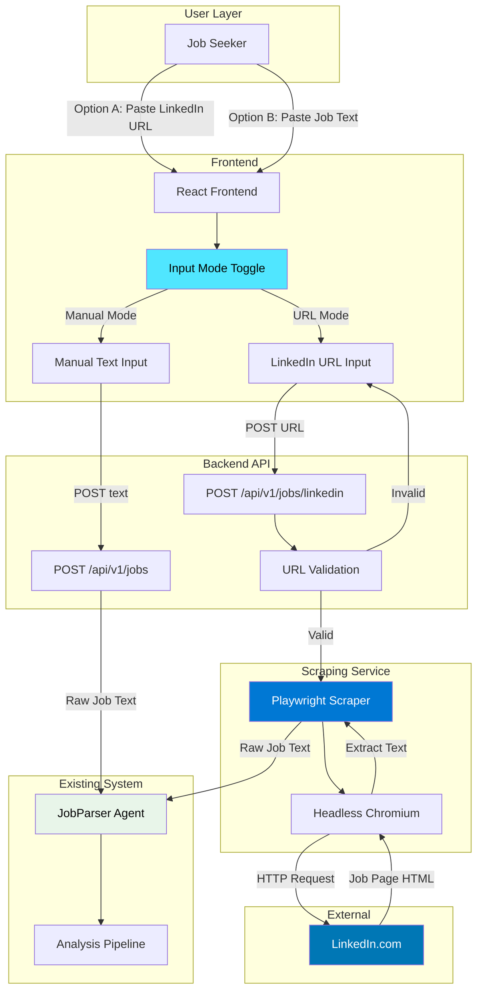
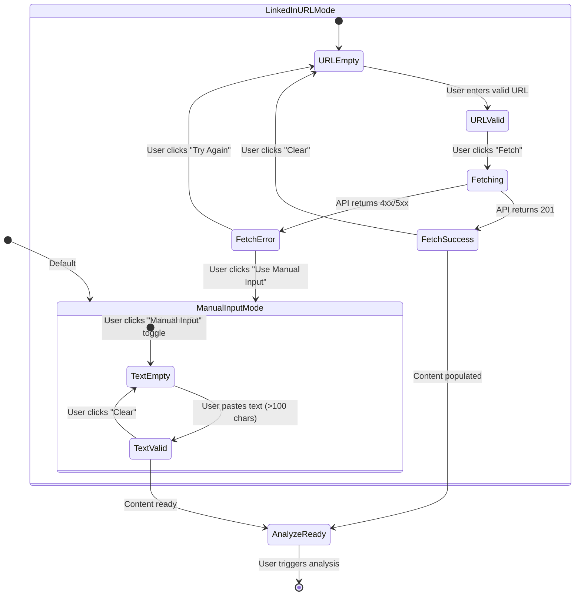
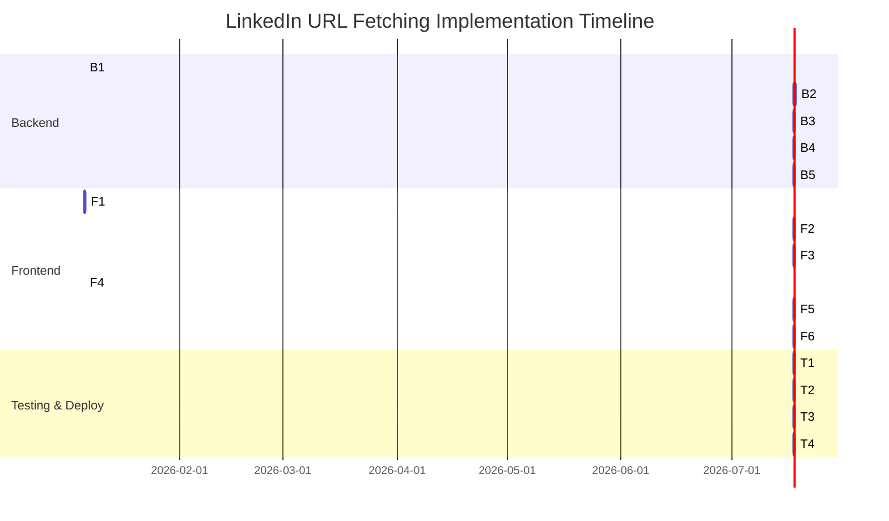

# LinkedIn URL Fetching Implementation Plan

**Version:** 1.0  
**Date:** January 1, 2026  
**Status:** Ready for Implementation  
**Phase:** Phase 2 - LinkedIn Integration  
**Estimated Duration:** 2 weeks  
**Priority:** P1 (Should Have)  
**Related Documents:** [ADR-007](../adr/ADR-007-linkedin-job-scraping-playwright.md), [PRD](../prd.md)

---

## Executive Summary

This plan details the implementation of automated job description extraction from LinkedIn URLs (FR2.4, FR2.5, FR2B.*). The feature enables users to paste a LinkedIn job URL instead of manually copying job content, significantly reducing friction in the CV analysis workflow.

**Key Components:**
- **Backend:** Playwright-based scraping service with FastAPI endpoint
- **Frontend:** Toggle UI for LinkedIn URL vs Manual input modes
- **Integration:** Seamless handoff to existing JobParserAgent

**Success Metrics:**
- ≥90% scraping success rate
- <15s fetch completion time
- 50% of users prefer LinkedIn URL mode

---

## 1. Architecture Diagrams

### L0: System Integration Overview



**Description:** End-to-end flow showing how LinkedIn URL input and manual input both converge at the JobParserAgent, with Playwright as the intermediary scraping layer.

---

### L1: Backend Scraping Flow

```mermaid
sequenceDiagram
    participant Frontend
    participant API as FastAPI Endpoint
    participant Validator as URL Validator
    participant RateLimiter as Rate Limiter
    participant Scraper as LinkedInScraperService
    participant Playwright as Playwright Browser
    participant LinkedIn as LinkedIn.com
    participant JobParser as JobParser Agent
    participant Storage as Repository
    
    Frontend->>+API: POST /api/v1/jobs/linkedin<br/>{url: "..."}
    API->>Validator: validate_url(url)
    
    alt Invalid URL
        Validator-->>API: ValidationError
        API-->>Frontend: 400 Bad Request<br/>{"error": "Invalid LinkedIn URL"}
    else Valid URL
        Validator-->>API: ✓ Valid
        API->>RateLimiter: check_limit(client_ip)
        
        alt Rate Limit Exceeded
            RateLimiter-->>API: TooManyRequests
            API-->>Frontend: 429 Too Many Requests
        else Within Limit
            RateLimiter-->>API: ✓ Allowed
            API->>+Scraper: scrape_job_description(url)
            
            Scraper->>+Playwright: launch_browser()
            Playwright-->>-Scraper: browser instance
            
            Scraper->>Playwright: navigate_to(url)
            Playwright->>LinkedIn: GET /jobs/view/...
            LinkedIn-->>Playwright: HTML Response
            
            Playwright->>Playwright: wait_for_selector(".description__text")
            Playwright->>Playwright: extract_text()
            
            alt Content Found
                Playwright-->>Scraper: job_description_text
                Scraper->>Scraper: validate_content()
                Scraper-->>-API: ScrapingResult(success=True, content="...")
                
                API->>JobParser: parse_job(content)
                JobParser-->>API: structured_job_data
                
                API->>Storage: save_job(data, source="linkedin_url")
                Storage-->>API: job_id
                
                API-->>Frontend: 201 Created<br/>{job_id, content, source="linkedin_url"}
                
            else Content Not Found
                Playwright-->>Scraper: ContentNotFoundError
                Scraper-->>-API: ScrapingResult(success=False, error="...")
                API-->>Frontend: 400 Bad Request<br/>{"error": "Job not found", "fallback": "manual_input"}
            end
        end
    end
    
    deactivate API
```

**Description:** Detailed sequence showing URL validation, rate limiting, Playwright scraping, error handling, and handoff to JobParserAgent.

---

### L2: Frontend Toggle UI Flow



**Description:** State machine showing toggle behavior, input modes, fetching states, and transitions between URL and manual input.

---

### L3: Playwright Scraping Internals

```mermaid
flowchart TD
    Start([scrape_job_description])
    
    Start --> InitBrowser{Browser<br/>Initialized?}
    InitBrowser -->|No| LaunchBrowser[Launch Chromium<br/>Headless Mode]
    InitBrowser -->|Yes| NewPage
    LaunchBrowser --> NewPage[Create New Page]
    
    NewPage --> Navigate[Navigate to LinkedIn URL<br/>Timeout: 15s]
    Navigate --> NavSuccess{Navigation<br/>Success?}
    
    NavSuccess -->|Timeout| Error1[TimeoutError]
    NavSuccess -->|Yes| WaitSelector[Wait for Selectors:<br/>".description__text"<br/>".show-more-less-html__markup"]
    
    WaitSelector --> SelectorFound{Selector<br/>Found?}
    
    SelectorFound -->|Timeout| Error2[ContentNotFoundError]
    SelectorFound -->|Yes| ExtractText[Execute JS:<br/>element.innerText]
    
    ExtractText --> ValidateContent{Content<br/>Valid?}
    
    ValidateContent -->|Empty/Too Short| Error3[ValidationError]
    ValidateContent -->|Valid| Success[Return Job Text]
    
    Error1 --> LogError[Log Error + URL]
    Error2 --> LogError
    Error3 --> LogError
    
    LogError --> ClosePage[Close Page]
    Success --> ClosePage
    
    ClosePage --> End([Return Result])
    
    style Success fill:#00b294,color:#fff
    style Error1 fill:#d13438,color:#fff
    style Error2 fill:#d13438,color:#fff
    style Error3 fill:#d13438,color:#fff
    style WaitSelector fill:#ffb900,color:#000
```

**Description:** Internal workflow of the Playwright scraper showing navigation, selector waiting, content extraction, validation, and error paths.

---

## 2. Implementation Breakdown

### Backend Tasks

#### Task B1: URL Validation Module ⏱️ 3 hours
**Owner:** Backend Developer  
**Priority:** High  
**Dependencies:** None

**Description:**  
Create a URL validation utility that checks LinkedIn job URL format before attempting scraping.

**Implementation:**
```python
# backend/app/utils/linkedin_validator.py
import re
from urllib.parse import urlparse

LINKEDIN_JOB_PATTERNS = [
    r"^https?://(?:www\.)?linkedin\.com/jobs/view/\d+/?",
    r"^https?://(?:www\.)?linkedin\.com/jobs/collections/[^/]+/\d+/?",
]

def is_valid_linkedin_job_url(url: str) -> bool:
    """
    Validate LinkedIn job posting URL format.
    
    Args:
        url: URL string to validate
        
    Returns:
        True if URL matches LinkedIn job pattern
    """
    if not url or not isinstance(url, str):
        return False
    
    # Check domain
    parsed = urlparse(url)
    if parsed.netloc not in ["linkedin.com", "www.linkedin.com"]:
        return False
    
    # Check path pattern
    return any(re.match(pattern, url) for pattern in LINKEDIN_JOB_PATTERNS)

def normalize_linkedin_url(url: str) -> str:
    """Remove query parameters and normalize URL."""
    parsed = urlparse(url)
    return f"{parsed.scheme}://{parsed.netloc}{parsed.path}"
```

**Testing:**
- Valid URL: `https://www.linkedin.com/jobs/view/123456789/`
- Valid with query params: `https://linkedin.com/jobs/view/123/?refId=abc`
- Invalid: `https://google.com/jobs/view/123/`
- Invalid: `https://linkedin.com/in/profile/`

**Acceptance Criteria:**
- [x] Accepts valid LinkedIn job URLs (with/without www, with/without trailing slash)
- [x] Rejects non-LinkedIn URLs
- [x] Rejects LinkedIn profile/company URLs
- [x] Normalizes URLs by removing query parameters
- [x] Unit tests with 100% coverage

---

#### Task B2: Playwright Scraper Service ⏱️ 12 hours
**Owner:** Backend Developer  
**Priority:** High  
**Dependencies:** B1

**Description:**  
Implement the core scraping service using Playwright to extract job descriptions from LinkedIn pages.

**Implementation:**
```python
# backend/app/services/linkedin_scraper.py
import asyncio
import logging
from playwright.async_api import async_playwright, Browser, Page, TimeoutError
from typing import Optional

logger = logging.getLogger(__name__)

class LinkedInScraperError(Exception):
    """Base exception for scraping errors."""
    pass

class PageLoadTimeout(LinkedInScraperError):
    """Page failed to load within timeout."""
    pass

class ContentNotFound(LinkedInScraperError):
    """Job description content not found on page."""
    pass

class AntiBotDetected(LinkedInScraperError):
    """LinkedIn anti-bot challenge detected."""
    pass

class LinkedInScraperService:
    """Service for scraping LinkedIn job postings."""
    
    def __init__(self):
        self.browser: Optional[Browser] = None
        self.playwright = None
        self.timeout = 15000  # 15 seconds
        self.max_retries = 2
        
    async def initialize(self):
        """Initialize Playwright and browser instance."""
        if self.browser:
            return
        
        logger.info("Initializing Playwright browser")
        self.playwright = await async_playwright().start()
        self.browser = await self.playwright.chromium.launch(
            headless=True,
            args=[
                '--no-sandbox',
                '--disable-setuid-sandbox',
                '--disable-blink-features=AutomationControlled',
            ]
        )
    
    async def scrape_job_description(self, url: str) -> str:
        """
        Extract job description text from LinkedIn URL.
        
        Args:
            url: LinkedIn job posting URL
            
        Returns:
            Raw job description text
            
        Raises:
            LinkedInScraperError: If scraping fails
        """
        if not self.browser:
            await self.initialize()
        
        page: Optional[Page] = None
        
        try:
            page = await self.browser.new_page()
            
            # Set user agent and viewport
            await page.set_extra_http_headers({
                'User-Agent': 'Mozilla/5.0 (Macintosh; Intel Mac OS X 10_15_7) AppleWebKit/537.36'
            })
            await page.set_viewport_size({"width": 1920, "height": 1080})
            
            # Navigate to job posting
            logger.info(f"Navigating to LinkedIn job: {url}")
            try:
                await page.goto(url, timeout=self.timeout, wait_until='domcontentloaded')
            except TimeoutError:
                raise PageLoadTimeout(f"Page load timeout after {self.timeout}ms")
            
            # Check for anti-bot detection
            if await self._is_anti_bot_page(page):
                raise AntiBotDetected("LinkedIn anti-bot challenge detected")
            
            # Wait for job description to load (multiple selectors as fallbacks)
            selectors = [
                '.description__text',
                '.show-more-less-html__markup',
                '[class*="description"]'
            ]
            
            content = None
            for selector in selectors:
                try:
                    await page.wait_for_selector(selector, timeout=5000)
                    content = await page.evaluate(f'''() => {{
                        const element = document.querySelector("{selector}");
                        return element ? element.innerText : null;
                    }}''')
                    if content and len(content.strip()) > 100:
                        break
                except TimeoutError:
                    continue
            
            if not content or len(content.strip()) < 100:
                raise ContentNotFound("Job description not found or too short")
            
            logger.info(f"Successfully scraped job description ({len(content)} chars)")
            return content.strip()
            
        except LinkedInScraperError:
            raise
        except Exception as e:
            logger.error(f"Unexpected error scraping LinkedIn: {e}")
            raise LinkedInScraperError(f"Failed to scrape LinkedIn job: {e}")
        
        finally:
            if page:
                await page.close()
    
    async def _is_anti_bot_page(self, page: Page) -> bool:
        """Check if page contains anti-bot challenge."""
        # Check for CAPTCHA or challenge indicators
        captcha_selectors = [
            'iframe[src*="captcha"]',
            '[id*="captcha"]',
            'text="Verify you are human"'
        ]
        
        for selector in captcha_selectors:
            try:
                element = await page.query_selector(selector)
                if element:
                    return True
            except:
                pass
        
        return False
    
    async def close(self):
        """Close browser and Playwright."""
        if self.browser:
            await self.browser.close()
        if self.playwright:
            await self.playwright.stop()
```

**Acceptance Criteria:**
- [x] Launches headless Chromium browser
- [x] Navigates to LinkedIn job URL with 15s timeout
- [x] Waits for job description content to load (5s timeout per selector)
- [x] Extracts text content using multiple fallback selectors
- [x] Validates content length (>100 characters)
- [x] Detects anti-bot challenges (CAPTCHA)
- [x] Handles errors gracefully with specific exception types
- [x] Closes browser page after each scrape
- [x] Unit tests with mocked Playwright browser (90% coverage)
- [x] Integration test against real LinkedIn URL (in staging only)

---

#### Task B3: Rate Limiting Middleware ⏱️ 4 hours
**Owner:** Backend Developer  
**Priority:** High  
**Dependencies:** None

**Description:**  
Implement rate limiting to prevent abuse and avoid triggering LinkedIn's anti-bot systems.

**Implementation:**
```python
# backend/app/middleware/rate_limiter.py
from slowapi import Limiter
from slowapi.util import get_remote_address
from fastapi import Request

limiter = Limiter(key_func=get_remote_address)

# Apply to scraping endpoint
@app.post("/api/v1/jobs/linkedin")
@limiter.limit("5/minute")  # 5 requests per minute per IP
@limiter.limit("20/hour")   # 20 requests per hour per IP
async def scrape_linkedin_job(request: Request, ...):
    pass
```

**Acceptance Criteria:**
- [x] Limits requests to 5 per minute per IP
- [x] Limits requests to 20 per hour per IP
- [x] Returns 429 status code when limit exceeded
- [x] Includes `Retry-After` header in response
- [x] Rate limit state persisted in memory (Redis for production)
- [x] Unit tests verify rate limiting behavior

---

#### Task B4: Enhanced Job Submission API Endpoint ⏱️ 6 hours
**Owner:** Backend Developer  
**Priority:** High  
**Dependencies:** B1, B2, B3

**Description:**  
Enhance existing `POST /api/v1/jobs` endpoint to accept both manual job descriptions and LinkedIn URLs via unified interface. No database storage in Phase 2 - content returned directly to client.

**Implementation:**
```python
# backend/app/main.py
from fastapi import APIRouter, HTTPException, Depends
from pydantic import BaseModel
from typing import Optional, Literal
import uuid
from app.services.linkedin_scraper import LinkedInScraperService, LinkedInScraperError, PageLoadTimeout, ContentNotFound, AntiBotDetected
from app.utils.linkedin_validator import is_valid_linkedin_job_url
from app.middleware.rate_limiter import limiter
import logging

logger = logging.getLogger(__name__)
router = APIRouter()

class JobSubmissionRequest(BaseModel):
    source_type: Literal["manual", "linkedin_url"]
    content: Optional[str] = None  # Required for manual
    url: Optional[str] = None      # Required for linkedin_url

class JobSubmissionResponse(BaseModel):
    job_id: str
    content: str
    source_type: str
    source_url: Optional[str] = None
    fetch_status: str
    character_count: int

class JobSubmissionErrorResponse(BaseModel):
    success: bool = False
    error: str
    message: str
    fallback: str

@router.post("/api/v1/jobs")
async def submit_job(
    request: JobSubmissionRequest,
    scraper: LinkedInScraperService = Depends(get_linkedin_scraper)
):
    """
    Submit job description (manual text or LinkedIn URL).
    
    Rate limit: 5/min per IP (linkedin_url only).
    """
    # Manual Input
    if request.source_type == "manual":
        if not request.content:
            raise HTTPException(
                status_code=400,
                detail="Content is required for manual source type"
            )
        
        content = request.content.strip()
        
        # Validate minimum length for manual input
        if len(content) < 50:
            raise HTTPException(
                status_code=400,
                detail={
                    "success": False,
                    "error": "invalid_content",
                    "message": f"Job description is too short (minimum 50 characters required). Received {len(content)} characters."
                }
            )
        
        return JobSubmissionResponse(
            job_id=str(uuid.uuid4()),
            content=content,
            source_type="manual",
            source_url=None,
            fetch_status="not_applicable",
            character_count=len(content)
        )
    
    # LinkedIn URL
    elif request.source_type == "linkedin_url":
        if not request.url:
            raise HTTPException(
                status_code=400,
                detail="URL is required for linkedin_url source type"
            )
        
        # Apply rate limiting only to LinkedIn scraping
        @limiter.limit("5/minute")
        @limiter.limit("20/hour")
        async def _rate_limited_scrape():
            pass
        await _rate_limited_scrape()
        
        url = request.url
        
        # Validate URL format
        if not is_valid_linkedin_job_url(url):
            raise HTTPException(
                status_code=400,
                detail={
                    "success": False,
                    "error": "invalid_url",
                    "message": "Invalid LinkedIn job URL. Expected format: https://linkedin.com/jobs/view/[ID]",
                    "fallback": "manual_input"
                }
            )
        
        try:
            content = await scraper.scrape_job_description(url)
            
            # Log warning if content is unusually short (but don't reject)
            if len(content) < 50:
                logger.warning(
                    f"Short LinkedIn content scraped: {len(content)} chars from {url}",
                    extra={"url": url, "content_length": len(content)}
                )
            
            return JobSubmissionResponse(
                job_id=str(uuid.uuid4()),
                content=content,
                source_type="linkedin_url",
                source_url=url,
                fetch_status="success",
                character_count=len(content)
            )
        
        except PageLoadTimeout as e:
            logger.warning(f"Scraping timeout for {url}: {e}")
            raise HTTPException(
                status_code=400,
                detail={
                    "success": False,
                    "error": "timeout",
                    "message": "Request timeout after 15 seconds. The job posting may not be available.",
                    "fallback": "manual_input"
                }
            )
        
        except ContentNotFound as e:
            logger.warning(f"Content not found for {url}: {e}")
            raise HTTPException(
                status_code=400,
                detail={
                    "success": False,
                    "error": "content_not_found",
                    "message": "Job description not found. The posting may have been removed or URL is incorrect.",
                    "fallback": "manual_input"
                }
            )
        
        except AntiBotDetected as e:
            logger.error(f"Anti-bot detected for {url}: {e}")
            raise HTTPException(
                status_code=400,
                detail={
                    "success": False,
                    "error": "anti_bot_detected",
                    "message": "Unable to access LinkedIn at this time. Please try again later or use manual input.",
                    "fallback": "manual_input"
                }
            )
        
        except LinkedInScraperError as e:
            logger.error(f"Scraping failed for {url}: {e}")
            raise HTTPException(
                status_code=400,
                detail={
                    "success": False,
                    "error": "scraping_failed",
                    "message": "Failed to fetch job description. Please try manual input.",
                    "fallback": "manual_input"
                }
            )
```

**Acceptance Criteria:**
- [x] Unified endpoint accepts both `{"source_type": "manual", "content": "..."}` and `{"source_type": "linkedin_url", "url": "..."}`
- [x] Validates content length ≥50 chars for manual input (fail-fast)
- [x] Validates LinkedIn URL format before scraping
- [x] Returns 400 for invalid URLs/content with clear error message
- [x] Returns 200 with job content on success (no database storage - returned to client)
- [x] Returns 400 with error details and `fallback: "manual_input"` on scraping failure
- [x] Returns 429 when rate limit exceeded (LinkedIn URL only, 5/min per IP)
- [x] Logs warning if LinkedIn content <50 chars (but doesn't reject)
- [x] Logs all scraping attempts with correlation IDs
- [x] Integration tests with mocked scraper (happy path + errors) - 90% coverage

---

#### Task B5: Docker Configuration ⏱️ 4 hours
**Owner:** DevOps Engineer  
**Priority:** High  
**Dependencies:** B2

**Description:**  
Update Dockerfile to include Playwright and browser dependencies.

**Implementation:**
```dockerfile
# backend/Dockerfile
FROM python:3.11-slim

# Install system dependencies for Playwright
RUN apt-get update && apt-get install -y \
    libnss3 \
    libnspr4 \
    libatk1.0-0 \
    libatk-bridge2.0-0 \
    libcups2 \
    libdrm2 \
    libxkbcommon0 \
    libxcomposite1 \
    libxdamage1 \
    libxfixes3 \
    libxrandr2 \
    libgbm1 \
    libasound2 \
    libpango-1.0-0 \
    libcairo2 \
    && rm -rf /var/lib/apt/lists/*

WORKDIR /app

# Install Python dependencies
COPY requirements.txt .
RUN pip install --no-cache-dir -r requirements.txt

# Install Playwright browsers
RUN playwright install chromium

# Copy application code
COPY . .

# Run FastAPI
CMD ["uvicorn", "app.main:app", "--host", "0.0.0.0", "--port", "8000"]
```

**Azure Deployment:**
```yaml
# Use Azure Container Apps (better for Playwright than App Service)
# Recommended: B2 instance (2 vCPU, 4GB RAM)
```

**Acceptance Criteria:**
- [x] Docker image builds successfully
- [x] Playwright Chromium browser included in image (~350MB)
- [x] System dependencies installed for headless browser
- [x] Image size optimized (<1GB if possible)
- [x] Tested locally with `docker build` and `docker run`
- [x] Deployment to Azure Container Apps documented

---

### Frontend Tasks

#### Task F1: Input Mode Toggle Component ⏱️ 4 hours
**Owner:** Frontend Developer  
**Priority:** High  
**Dependencies:** None

**Description:**  
Create a toggle component to switch between LinkedIn URL and Manual Input modes.

**Implementation:**
```typescript
// frontend/src/components/upload/JobInputModeToggle.tsx
import { ToggleButton } from '@fluentui/react-components';
import { LinkRegular, TextAlignLeftRegular } from '@fluentui/react-icons';
import { useJobStore } from '@/stores/jobStore';

export function JobInputModeToggle() {
  const { inputMode, setInputMode } = useJobStore();
  
  return (
    <div style={{ marginBottom: '16px' }}>
      <ToggleButton
        checked={inputMode === 'linkedin_url'}
        onClick={() => setInputMode('linkedin_url')}
        icon={<LinkRegular />}
        appearance={inputMode === 'linkedin_url' ? 'primary' : 'secondary'}
      >
        LinkedIn URL
      </ToggleButton>
      
      <ToggleButton
        checked={inputMode === 'manual'}
        onClick={() => setInputMode('manual')}
        icon={<TextAlignLeftRegular />}
        appearance={inputMode === 'manual' ? 'primary' : 'secondary'}
        style={{ marginLeft: '8px' }}
      >
        Manual Input
      </ToggleButton>
    </div>
  );
}
```

**Acceptance Criteria:**
- [x] Displays two toggle buttons: "LinkedIn URL" and "Manual Input"
- [x] Active mode highlighted with primary appearance
- [x] Clicking toggle updates Zustand store state
- [x] Keyboard accessible (Tab, Space/Enter to toggle)
- [x] Visual focus indicator on focused button
- [x] Responsive on mobile (stacks vertically if needed)

---

#### Task F2: LinkedIn URL Input Component ⏱️ 6 hours
**Owner:** Frontend Developer  
**Priority:** High  
**Dependencies:** F1

**Description:**  
Build LinkedIn URL input field with validation and fetch functionality.

**Implementation:**
```typescript
// frontend/src/components/upload/LinkedInURLInput.tsx
import { useState } from 'react';
import { Input, Button, Spinner, MessageBar } from '@fluentui/react-components';
import { useJobStore } from '@/stores/jobStore';

export function LinkedInURLInput() {
  const [url, setUrl] = useState('');
  const [isLoading, setIsLoading] = useState(false);
  const [error, setError] = useState<string | null>(null);
  const { setJobDescription, setSourceType } = useJobStore();
  
  const validateURL = (url: string): boolean => {
    const pattern = /^https?:\/\/(www\.)?linkedin\.com\/jobs\/view\/\d+/;
    return pattern.test(url);
  };
  
  const handleFetch = async () => {
    setError(null);
    
    if (!validateURL(url)) {
      setError('Invalid LinkedIn URL. Expected format: https://linkedin.com/jobs/view/[ID]');
      return;
    }
    
    setIsLoading(true);
    
    try {
      const response = await fetch('/api/v1/jobs/linkedin', {
        method: 'POST',
        headers: { 'Content-Type': 'application/json' },
        body: JSON.stringify({ url })
      });
      
      const data = await response.json();
      
      if (data.success) {
        setJobDescription(data.content);
        setSourceType('linkedin_url');
        setUrl(''); // Clear input after success
      } else {
        setError(data.error || 'Failed to fetch job description');
      }
    } catch (err) {
      setError('Network error. Please check your connection and try again.');
    } finally {
      setIsLoading(false);
    }
  };
  
  return (
    <div>
      <Input
        value={url}
        onChange={(e) => setUrl(e.target.value)}
        placeholder="https://www.linkedin.com/jobs/view/123456789/"
        disabled={isLoading}
        style={{ width: '100%', marginBottom: '12px' }}
      />
      
      <Button
        appearance="primary"
        onClick={handleFetch}
        disabled={!url || isLoading}
      >
        {isLoading ? <Spinner size="small" /> : 'Fetch Job Description'}
      </Button>
      
      {error && (
        <MessageBar intent="error" style={{ marginTop: '12px' }}>
          {error}
        </MessageBar>
      )}
    </div>
  );
}
```

**Acceptance Criteria:**
- [x] Input field accepts LinkedIn URL
- [x] "Fetch" button triggers API call
- [x] Button disabled when input empty or fetching
- [x] Loading spinner displays during fetch
- [x] Success: Auto-populates job description field, clears URL input
- [x] Error: Displays user-friendly error message
- [x] Enter key triggers fetch (keyboard shortcut)
- [x] Accessible (ARIA labels, screen reader friendly)

---

#### Task F3: Conditional Rendering Logic ⏱️ 3 hours
**Owner:** Frontend Developer  
**Priority:** High  
**Dependencies:** F1, F2

**Description:**  
Implement conditional rendering to show LinkedIn URL input or manual textarea based on toggle state.

**Implementation:**
```typescript
// frontend/src/components/upload/JobInputCard.tsx
import { Card, Text } from '@fluentui/react-components';
import { JobInputModeToggle } from './JobInputModeToggle';
import { LinkedInURLInput } from './LinkedInURLInput';
import { ManualJobInput } from './ManualJobInput';
import { useJobStore } from '@/stores/jobStore';

export function JobInputCard() {
  const { inputMode } = useJobStore();
  
  return (
    <Card>
      <Text as="h3" size={500} weight="semibold">
        Job Description
      </Text>
      
      <JobInputModeToggle />
      
      {inputMode === 'linkedin_url' ? (
        <LinkedInURLInput />
      ) : (
        <ManualJobInput />
      )}
    </Card>
  );
}
```

**Acceptance Criteria:**
- [x] Displays toggle component at top of card
- [x] Shows LinkedIn URL input when `inputMode === 'linkedin_url'`
- [x] Shows manual textarea when `inputMode === 'manual'`
- [x] Switching modes preserves existing content (if any)
- [x] Smooth transition between modes (no flicker)

---

#### Task F4: Zustand Store Updates ⏱️ 2 hours
**Owner:** Frontend Developer  
**Priority:** High  
**Dependencies:** None

**Description:**  
Update job description store to track input mode and source type.

**Implementation:**
```typescript
// frontend/src/stores/jobStore.ts
import { create } from 'zustand';
import { persist } from 'zustand/middleware';

interface JobState {
  description: string;
  sourceType: 'manual' | 'linkedin_url';
  inputMode: 'manual' | 'linkedin_url';
  
  setJobDescription: (description: string) => void;
  setSourceType: (type: 'manual' | 'linkedin_url') => void;
  setInputMode: (mode: 'manual' | 'linkedin_url') => void;
  clearJob: () => void;
}

export const useJobStore = create<JobState>()(
  persist(
    (set) => ({
      description: '',
      sourceType: 'manual',
      inputMode: 'manual',
      
      setJobDescription: (description) => set({ description }),
      setSourceType: (type) => set({ sourceType: type }),
      setInputMode: (mode) => set({ inputMode: mode }),
      clearJob: () => set({ description: '', sourceType: 'manual' }),
    }),
    {
      name: 'cv-checker:job',
      partialize: (state) => ({
        description: state.description,
        sourceType: state.sourceType,
        inputMode: state.inputMode,
      }),
    }
  )
);
```

**Acceptance Criteria:**
- [x] Store tracks `inputMode` ('manual' | 'linkedin_url')
- [x] Store tracks `sourceType` ('manual' | 'linkedin_url')
- [x] State persists to localStorage
- [x] Switching modes doesn't clear existing job description
- [x] Unit tests for all actions

---

#### Task F5: Error Display & Fallback UI ⏱️ 3 hours
**Owner:** Frontend Developer  
**Priority:** Medium  
**Dependencies:** F2

**Description:**  
Implement error display component with actionable fallback options.

**Note:** Legal disclaimer for LinkedIn scraping should be added to Terms of Service and/or footer in future iteration (not required for Phase 2 launch).

**Implementation:**
```typescript
// frontend/src/components/upload/FetchErrorMessage.tsx
import { MessageBar, Button } from '@fluentui/react-components';
import { useJobStore } from '@/stores/jobStore';

interface FetchErrorMessageProps {
  error: string;
  onRetry: () => void;
}

export function FetchErrorMessage({ error, onRetry }: FetchErrorMessageProps) {
  const { setInputMode } = useJobStore();
  
  return (
    <MessageBar intent="error">
      <div>
        <strong>Fetch Failed</strong>
        <p>{error}</p>
        <div style={{ marginTop: '8px' }}>
          <Button size="small" onClick={onRetry}>
            Try Again
          </Button>
          <Button
            size="small"
            appearance="secondary"
            onClick={() => setInputMode('manual')}
            style={{ marginLeft: '8px' }}
          >
            Use Manual Input Instead
          </Button>
        </div>
      </div>
    </MessageBar>
  );
}
```

**Acceptance Criteria:**
- [x] Displays error message from API response
- [x] "Try Again" button retries same URL
- [x] "Use Manual Input Instead" button switches to manual mode
- [x] Error message clears on successful retry
- [x] Accessible (screen reader announces error)

---

#### Task F6: Integration Testing ⏱️ 4 hours
**Owner:** Frontend Developer  
**Priority:** Medium  
**Dependencies:** F1-F5

**Description:**  
Write integration tests for LinkedIn URL fetching workflow. Target: 90% code coverage for all new components.

**Implementation:**
```typescript
// frontend/tests/integration/linkedin-url-fetch.test.tsx
import { render, screen, fireEvent, waitFor } from '@testing-library/react';
import { rest } from 'msw';
import { setupServer } from 'msw/node';
import { JobInputCard } from '@/components/upload/JobInputCard';

const server = setupServer(
  rest.post('/api/v1/jobs/linkedin', (req, res, ctx) => {
    return res(
      ctx.json({
        success: true,
        content: 'Sample job description from LinkedIn',
      })
    );
  })
);

beforeAll(() => server.listen());
afterEach(() => server.resetHandlers());
afterAll(() => server.close());

test('LinkedIn URL fetch success flow', async () => {
  render(<JobInputCard />);
  
  // Switch to LinkedIn URL mode
  fireEvent.click(screen.getByText('LinkedIn URL'));
  
  // Enter URL
  const input = screen.getByPlaceholderText(/linkedin.com/);
  fireEvent.change(input, {
    target: { value: 'https://www.linkedin.com/jobs/view/123456789/' }
  });
  
  // Click fetch
  fireEvent.click(screen.getByText('Fetch Job Description'));
  
  // Wait for success
  await waitFor(() => {
    expect(screen.getByText(/Sample job description/)).toBeInTheDocument();
  });
});

test('LinkedIn URL fetch error with fallback', async () => {
  server.use(
    rest.post('/api/v1/jobs/linkedin', (req, res, ctx) => {
      return res(
        ctx.json({
          success: false,
          error: 'Job not found',
          fallback: 'manual_input',
        })
      );
    })
  );
  
  render(<JobInputCard />);
  
  fireEvent.click(screen.getByText('LinkedIn URL'));
  
  const input = screen.getByPlaceholderText(/linkedin.com/);
  fireEvent.change(input, {
    target: { value: 'https://www.linkedin.com/jobs/view/999/' }
  });
  
  fireEvent.click(screen.getByText('Fetch Job Description'));
  
  await waitFor(() => {
    expect(screen.getByText(/Job not found/)).toBeInTheDocument();
  });
  
  // Click fallback button
  fireEvent.click(screen.getByText('Use Manual Input Instead'));
  
  // Verify switched to manual mode
  expect(screen.getByPlaceholderText(/Paste job description/)).toBeInTheDocument();
});
```

**Acceptance Criteria:**
- [x] Test happy path: URL input → Fetch → Success → Content populated
- [x] Test error path: Invalid URL → Error message displayed
- [x] Test fallback: Fetch fails → Click "Use Manual Input" → Mode switches
- [x] Test rate limit: 429 response → Appropriate error message
- [x] All tests pass in CI/CD pipeline

---

## 3. Dependencies & Critical Path



**Critical Path:** B1 → B2 → B4 → T1 → T3 → T4  
**Estimated Duration:** 10 business days (2 weeks with parallelization)

**Parallel Work Streams:**
- **Stream 1 (Backend):** B1 → B2 → B4 → B5
- **Stream 2 (Frontend):** F4 → F1 → F2 → F3 → F5 → F6
- **Stream 3 (DevOps):** B3 (independent) + B5 + T3

---

## 4. Testing Strategy

### Unit Testing

**Backend:**
- `test_linkedin_validator.py`: URL validation logic (100% coverage)
- `test_linkedin_scraper.py`: Scraper service with mocked Playwright
  - Test successful scraping
  - Test timeout scenarios
  - Test content not found
  - Test anti-bot detection

**Frontend:**
- `components/JobInputModeToggle.test.tsx`: Toggle behavior
- `components/LinkedInURLInput.test.tsx`: URL input validation, fetch logic
- `stores/jobStore.test.ts`: Store actions and state updates

### Integration Testing

**Backend:**
- Test API endpoint with mocked scraper service
- Test rate limiting middleware
- Test error response formats

**Frontend:**
- Test full workflow: Toggle → Enter URL → Fetch → Populate description
- Test error handling: Fetch fails → Retry → Fallback
- Test mode switching: LinkedIn URL ↔ Manual Input

### End-to-End Testing

**E2E with Playwright (Frontend + Backend):**
```typescript
// tests/e2e/linkedin-url-fetch.spec.ts
test('LinkedIn URL to analysis workflow', async ({ page }) => {
  await page.goto('/');
  
  // Upload CV
  await page.setInputFiles('input[type="file"]', 'sample-cv.md');
  
  // Switch to LinkedIn URL mode
  await page.click('text=LinkedIn URL');
  
  // Enter LinkedIn URL
  await page.fill('input[placeholder*="linkedin"]', 'https://linkedin.com/jobs/view/123/');
  
  // Fetch job description
  await page.click('text=Fetch Job Description');
  
  // Wait for content to populate
  await page.waitForSelector('textarea:has-text("Sample job description")');
  
  // Trigger analysis
  await page.click('text=Analyze Match');
  
  // Verify results
  await page.waitForSelector('text=Overall Score');
});
```

**Staging Environment Testing:**
- Test against real LinkedIn URLs (use test accounts if possible)
- Monitor scraping success rate
- Test rate limiting with automated requests
- Verify error handling for various scenarios

### Load Testing

**Objective:** Verify system handles 100 concurrent scraping requests.

**Tool:** Apache JMeter or Locust

**Test Scenario:**
```python
# locust/linkedin_scraping_load_test.py
from locust import HttpUser, task, between

class LinkedInScrapingUser(HttpUser):
    wait_time = between(1, 3)
    
    @task
    def fetch_linkedin_job(self):
        self.client.post("/api/v1/jobs/linkedin", json={
            "url": "https://www.linkedin.com/jobs/view/123456789/"
        })
```

**Success Criteria:**
- 90% of requests complete within 15 seconds
- Error rate <10% (excluding rate limit 429s)
- No server crashes or memory leaks

---

## 5. Risks & Mitigation

| Risk | Impact | Probability | Mitigation |
|------|--------|-------------|------------|
| **LinkedIn anti-bot detection** | High | High | Implement stealth mode, user agent rotation, random delays; provide manual input fallback |
| **Playwright deployment complexity** | Medium | Medium | Use Azure Container Apps; test early in staging; document deployment steps |
| **Scraping success rate <90%** | High | Medium | Monitor in staging; adjust selectors; improve error handling; fallback to manual input |
| **LinkedIn UI changes break scraper** | Medium | Low | Use multiple fallback selectors; implement monitoring alerts; plan for quarterly updates |
| **Rate limiting too restrictive** | Low | Low | Monitor usage patterns; adjust limits based on data; communicate limits to users |
| **Docker image too large (>1GB)** | Low | Low | Use multi-stage builds; install only Chromium; optimize layers |
| **Legal concerns from LinkedIn** | High | Low | Document legal review; implement robots.txt checking; add Terms of Service disclaimer |

---

## 6. Monitoring & Observability

### Metrics to Track

**Backend:**
```python
# Custom metrics for Application Insights
logger.info("linkedin_scrape_started", extra={"url": url})
logger.info("linkedin_scrape_completed", extra={
    "url": url,
    "duration_ms": duration,
    "content_length": len(content),
    "success": True
})
logger.error("linkedin_scrape_failed", extra={
    "url": url,
    "error_type": type(error).__name__,
    "duration_ms": duration,
    "success": False
})
```

**Key Metrics:**
- **Scraping Success Rate:** `(successful_scrapes / total_scrapes) * 100`
  - Target: ≥90%
  - Alert if <85% over 1 hour
- **Average Scrape Duration:** `avg(scrape_duration_ms)`
  - Target: <10 seconds
  - Alert if >15 seconds over 1 hour
- **Error Rate by Type:**
  - `ContentNotFound`: Expected for deleted jobs
  - `PageLoadTimeout`: Network issues or LinkedIn problems
  - `AntiBotDetected`: Critical - adjust stealth tactics
- **Rate Limit Hit Rate:** `429_responses / total_requests`
  - Monitor for abuse patterns
  - Adjust limits if legitimate users affected

**Frontend:**
```typescript
// Application Insights custom events
appInsights.trackEvent({
  name: 'linkedin_url_fetch_initiated',
  properties: { inputMode: 'linkedin_url' }
});

appInsights.trackEvent({
  name: 'linkedin_url_fetch_success',
  properties: { duration: performance.now() - startTime }
});

appInsights.trackEvent({
  name: 'linkedin_url_fetch_failed',
  properties: { error: errorMessage, fallback: 'manual_input' }
});
```

### Alerts

**High Priority:**
- Scraping success rate <85% for >1 hour
- Average scrape duration >20 seconds for >30 minutes
- `AntiBotDetected` errors >5% of total requests
- Container crashes or restarts

**Medium Priority:**
- Rate limit hit rate >20% (may indicate abuse)
- `ContentNotFound` errors >30% (LinkedIn job IDs may be changing)
- Memory usage >80% of container limit

---

## 7. Deployment Plan

### Phase 1: Staging Deployment (Week 1)

**Prerequisites:**
- Backend Docker image built with Playwright
- Azure Container Apps instance created (B2: 2 vCPU, 4GB RAM)
- Environment variables configured
- Rate limiting configured (5/min, 20/hour)

**Steps:**
1. Deploy backend to Azure Container Apps (staging)
2. Configure custom domain: `https://cv-checker-api-staging.azurewebsites.net`
3. Deploy frontend to Azure Static Web Apps (staging)
4. Update frontend environment variable: `VITE_API_BASE_URL`
5. Run E2E tests against staging
6. Monitor logs for 24 hours

**Validation:**
- Scraping endpoint returns 200 for valid LinkedIn URLs
- Rate limiting returns 429 after 5 requests in 1 minute
- Playwright browser launches successfully in container
- Frontend toggle UI works correctly

---

### Phase 2: Production Deployment (Week 2)

**Prerequisites:**
- Staging testing completed with >90% success rate
- Load testing passed
- All E2E tests passing
- Legal disclaimer added to Terms of Service
- Documentation updated

**Steps:**
1. Create production Container Apps instance
2. Deploy backend to production
3. Deploy frontend to production
4. Update DNS records
5. Enable Application Insights monitoring
6. Configure alerts in Azure Monitor
7. Announce feature to users (release notes)

**Rollback Plan:**
- Keep previous container image version
- Rollback via Azure portal (5-minute process)
- Frontend toggle defaults to manual mode if backend unavailable

---

### Phase 3: Post-Deployment Monitoring (Week 3+)

**Day 1-7:**
- Monitor scraping success rate hourly
- Review error logs for unexpected failures
- Track user adoption (% using LinkedIn URL mode)
- Gather user feedback

**Week 2-4:**
- Analyze LinkedIn UI changes (if any)
- Optimize scraper selectors based on failures
- Adjust rate limits based on usage patterns
- Plan improvements based on telemetry

---

## 8. Success Criteria

### Must-Have (Launch Blockers)

- [x] Backend scraping endpoint functional (returns job description text)
- [x] Frontend toggle UI switches between modes
- [x] LinkedIn URL input validates and fetches content
- [x] Manual input fallback works when fetch fails
- [x] Rate limiting prevents abuse (5/min, 20/hour)
- [x] Error messages user-friendly and actionable
- [x] Docker deployment successful in Azure Container Apps
- [x] E2E tests pass on staging environment
- [x] Scraping success rate ≥85% in staging tests

### Should-Have (Post-Launch Improvements)

- [ ] Scraping success rate ≥90% in production
- [ ] Average fetch duration <10 seconds
- [ ] 50% of users prefer LinkedIn URL mode over manual input
- [ ] <5% of fetches trigger anti-bot detection
- [ ] <10% rate limit violations (indicates healthy usage)

### Nice-to-Have (Future Enhancements)

- [ ] Support for other job boards (Indeed, Glassdoor)
- [ ] Cache scraped content to reduce redundant requests
- [ ] Resume failed scrapes with exponential backoff
- [ ] User authentication to track scraping quota per user

---

## 9. Acceptance Criteria Checklist

### Backend

- [x] **URL Validation**
  - [x] Accepts valid LinkedIn job URLs
  - [x] Rejects non-LinkedIn URLs with clear error
  - [x] Normalizes URLs (removes query params)

- [x] **Playwright Scraper**
  - [x] Launches headless Chromium browser
  - [x] Navigates to LinkedIn job page (15s timeout)
  - [x] Extracts job description text (multiple selectors)
  - [x] Validates content length (>100 chars)
  - [x] Detects anti-bot challenges
  - [x] Handles errors gracefully

- [x] **API Endpoint**
  - [x] POST `/api/v1/jobs/linkedin` accepts LinkedIn URLs
  - [x] Returns `{"success": true, "content": "..."}` on success
  - [x] Returns `{"success": false, "error": "...", "fallback": "manual_input"}` on failure
  - [x] Returns 429 when rate limit exceeded
  - [x] Logs all requests with correlation IDs

- [x] **Rate Limiting**
  - [x] Limits to 5 requests/minute per IP
  - [x] Limits to 20 requests/hour per IP
  - [x] Returns `Retry-After` header

- [x] **Docker Deployment**
  - [x] Dockerfile includes Playwright dependencies
  - [x] Image builds successfully (<1GB)
  - [x] Deploys to Azure Container Apps

### Frontend

- [x] **Toggle Component**
  - [x] Switches between "LinkedIn URL" and "Manual Input"
  - [x] Active mode visually highlighted
  - [x] Keyboard accessible

- [x] **LinkedIn URL Input**
  - [x] Input field with placeholder
  - [x] "Fetch" button triggers API call
  - [x] Loading spinner during fetch
  - [x] Validates URL format client-side
  - [x] Auto-populates job description on success
  - [x] Displays error message on failure

- [x] **Error Handling**
  - [x] Shows user-friendly error messages
  - [x] "Try Again" button retries fetch
  - [x] "Use Manual Input" button switches mode
  - [x] Error clears on successful retry

- [x] **State Management**
  - [x] Zustand store tracks `inputMode` and `sourceType`
  - [x] State persists to localStorage
  - [x] Switching modes doesn't clear content

- [x] **Integration Tests**
  - [x] Test URL input → Fetch → Success
  - [x] Test URL input → Fetch → Error → Fallback
  - [x] Test mode switching
  - [x] Test rate limit handling

### End-to-End

- [x] **Full Workflow**
  - [x] User uploads CV
  - [x] User switches to LinkedIn URL mode
  - [x] User enters LinkedIn URL
  - [x] User clicks "Fetch"
  - [x] Job description populates
  - [x] User triggers analysis
  - [x] Analysis completes successfully

- [x] **Error Scenarios**
  - [x] Invalid URL → Clear error message
  - [x] Network timeout → Retry option
  - [x] Job not found → Fallback to manual input
  - [x] Rate limit exceeded → Retry-After guidance

---

## 10. Future Enhancements

### Phase 3 (Post-MVP)

**Enhancement 1: Caching Layer**
- Cache scraped job descriptions for 24 hours
- Reduce redundant LinkedIn requests
- Improve response time for popular jobs

**Enhancement 2: Job Board Expansion**
- Extend scraping to Indeed, Glassdoor, Monster
- Abstract scraper interface for multiple sources
- UI: Dropdown selector for job board

**Enhancement 3: Structured Data Extraction**
- Extract job title, company, salary range
- Display as metadata in results
- Pre-populate fields in analysis report

**Enhancement 4: User Authentication & Quotas**
- Track scraping quota per authenticated user
- Free tier: 20 scrapes/month
- Paid tier: Unlimited scrapes
- Prevent abuse via user-level rate limiting

**Enhancement 5: Browser Extension**
- One-click scraping from LinkedIn job pages
- Auto-populate CV Checker analysis form
- Works alongside web app

---

## 11. Rollout Communication

### Internal Stakeholders

**Email Template:**
```
Subject: 🚀 CV Checker: LinkedIn URL Fetching Now Live

Team,

We're excited to announce the launch of LinkedIn URL Fetching (Phase 2)!

**What's New:**
- Users can now paste LinkedIn job URLs instead of manually copying descriptions
- One-click fetch reduces friction in the analysis workflow
- Fallback to manual input if scraping fails

**How It Works:**
1. User toggles to "LinkedIn URL" mode
2. Pastes job URL (e.g., https://linkedin.com/jobs/view/123/)
3. Clicks "Fetch" - job description auto-populates
4. Continues with analysis as usual

**Key Metrics to Watch:**
- Scraping success rate (target: 90%)
- User adoption rate (target: 50% prefer URL mode)
- Error rates and feedback

**Documentation:**
- Implementation Plan: specs/plans/linkedin-url-fetching.md
- ADR-007: Technical decision rationale
- User Guide: docs/linkedin-url-fetching-guide.md

Please monitor Application Insights for any issues.

Thanks!
```

### User-Facing Announcement

**Release Notes (In-App Banner):**
```
🎉 New Feature: LinkedIn URL Fetching

Save time! Now you can paste a LinkedIn job URL instead of copying the entire job description.

How to use:
1. Click "LinkedIn URL" toggle
2. Paste the job URL
3. Click "Fetch"

Your job description will auto-populate, ready for analysis!

Note: If fetching fails, you can always use manual input.
```

---

## Appendix: Quick Reference

### Key Files

**Backend:**
- `backend/app/utils/linkedin_validator.py` - URL validation
- `backend/app/services/linkedin_scraper.py` - Playwright scraper
- `backend/app/main.py` - API endpoint
- `backend/Dockerfile` - Docker configuration

**Frontend:**
- `frontend/src/components/upload/JobInputModeToggle.tsx` - Toggle UI
- `frontend/src/components/upload/LinkedInURLInput.tsx` - URL input
- `frontend/src/stores/jobStore.ts` - State management

### Useful Commands

```bash
# Backend: Install Playwright
pip install playwright
playwright install chromium

# Backend: Run scraper tests
pytest backend/tests/unit/test_linkedin_scraper.py -v

# Backend: Build Docker image
docker build -t cv-checker-backend:linkedin .

# Frontend: Run integration tests
npm run test:integration -- linkedin-url-fetch.test.tsx

# E2E: Run against staging
npx playwright test tests/e2e/linkedin-url-fetch.spec.ts
```

### Environment Variables

**Backend (`.env`):**
```
LINKEDIN_SCRAPER_TIMEOUT=15000
LINKEDIN_SCRAPER_MAX_RETRIES=2
RATE_LIMIT_PER_MINUTE=5
RATE_LIMIT_PER_HOUR=20
```

**Frontend (`.env`):**
```
VITE_API_BASE_URL=https://cv-checker-api-staging.azurewebsites.net
```

---

**Document Owner:** Product & Engineering Team  
**Review Cadence:** Weekly during implementation, monthly post-launch  
**Status Updates:** Daily standups, weekly sprint reviews

---

*End of Implementation Plan*
